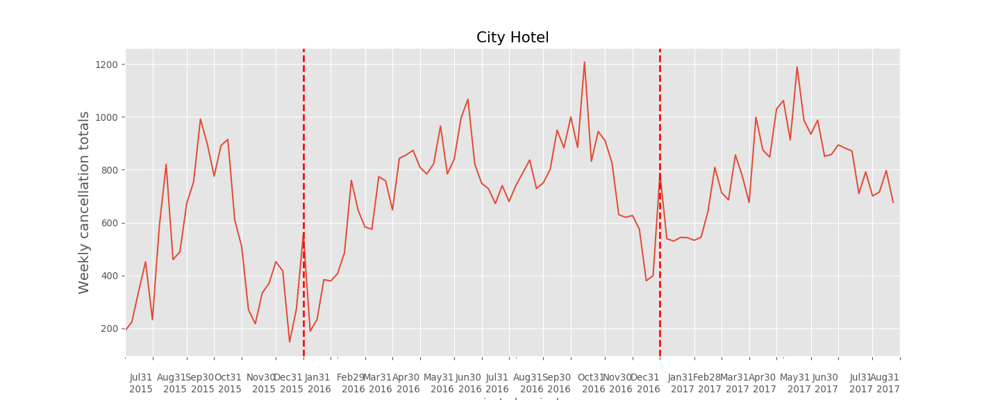
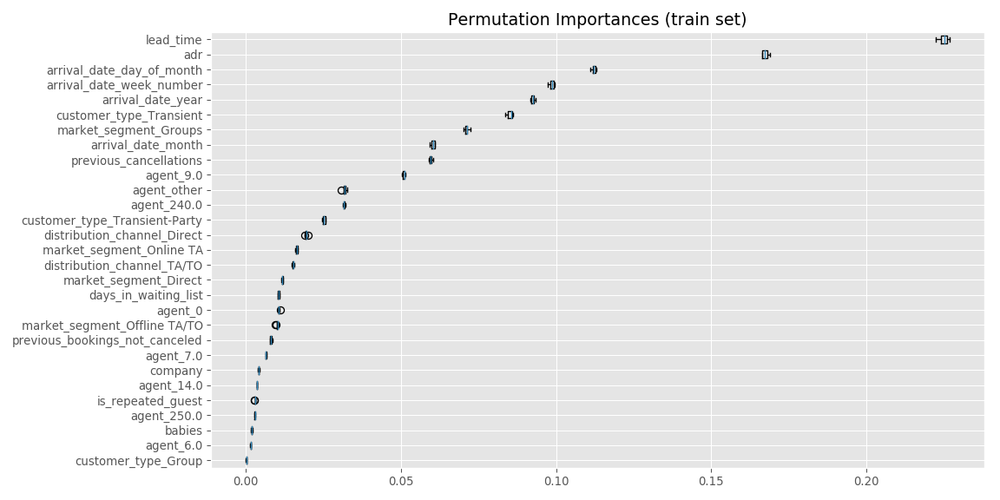

Milestone Report: Predicting Hotel Cancellations
================
Matthew Merrill

## Project Proposal

My project will seek to solve a common but surging issue for the hotel
industry, predicting cancellations and maintaining brand integrity among
surging customer interest in booking through online travel agents,
rather than direct. According to a study conducted by D-Edge Hospitality
Solutions, cancellation rates in the hotel industry increased more than
8 percent from 2014 to 2017\[1\]

The impact on the industry has come from pressure primarily stemming
from online travel agencies and their adoption of ‘Risk Free
Reservations’. While OTA’s use cancellations as a way to expand their
market availability and retain customer loyalty, hotels risk the ability
to forecast revenue and maintain brand integrity in the process\[2\]

Hotels often desire to create a personalized ease of service for
customers from the moment of booking, but OTA’s want their customers to
adopt a ‘book now, ask questions later’ mentality. The preference for
customers often falls towards the OTA’s, because they will often
advertise a lower price than booking direct, as they absorb the
cancellation risk, which creates a strain on the hotels’ customer
relationship and diminishes the booking experience. While OTA’s do draw
in customers and expand outreach for hotels, there is an opportunity to
optimize customer channels and lower risk, while increasing real-time
income.

The outcome of this project will give the client insights into
predicting cancellations and provide suggestions for modifying their
cancellation policy. This will provide the hotel with the ability to
optimize customer channels, maintain brand integrity and increase
customer loyalty.

The dataset was obtained from [Science
Direct](https://www.sciencedirect.com) and contains a collection of
observations taken from 2015 to 2017 of guest bookings for two hotels,
both located in Portugal. The data was collected directly from the
hotels’ PMS (property management system) database and was relatively
clean and structured upon retrieval. Each observation represents a
booking, with the variables capturing details including when it was
booked, dates of stay, through which operator the guest chose to go
through, if that booking was cancelled and the average daily rate. Once
this project is complete, I will be able to provide insights on the
following questions:

> Can we predict if a guest will cancel a reservation at the moment of
> booking? What inferences can we draw from cancellation patterns that
> would help optimize customer channels and lower the overall risk for a
> hotel?

I will attempt to solve this problem by investigating where
cancellations primarily occur and during what time of the year. After
drawing insights from the exploratory data analysis phase, the dataset
will be modified for the modeling process with the goal of predicting
the cancelation column of the set. Insights from the model and from the
exploratory phase will lead to suggestions to the client that will help
them forecast cancellations and optimize customer channels as mentioned
above.

The client will receive the working model in the form of a web
application as well as a summary paper and slide deck. The slide deck
will summarize the findings and attempt to “sell” the work to the
client, and the paper will summarize the details. Code will be provided
for inspection and reproducibility for the client.

## Data Wrangling and Cleaning Steps

The data I obtained was relatively clean to begin with, however there
were a few instances of “NULL” and empty entries as well as mislabeled
entries that needed clarification. The convention for null data was a
string with 7 spaces before NULL (“NULL”), so this was found and
replaced with `numpy`’s NAN entry for ease of identification. At this
point it was a matter of understanding the data to replace NAN values
with appropriate labels for the variable.

The variables with NAN entries were the company, agent and country
columns. Upon more exploration of the data and its source website, it
was discovered that for company and agent, null entries correlated to
customers that did not go through a company or agent to book. To correct
this, the original company and agent names were replaced with string
numerics to protect anonymity so to continue with this convention, nan
entries were replaced with “0” to represent “no agent” or “no company”.
The country column had no added clarification for the nan entries, so it
was decided that “UNK” for unknown would be used instead. The last step
for cleaning was to create a datetime column for a guest’s date of
arrival. The data provided the day, month and year separately for
arrival, so these were combined and converted to datetime format to
allow more versatility in analysis.

Lastly, the data was explored to identify any outliers that may skew
analysis. A few peculiar entries were found. For example, one group
booked 2 years in advance and one brought 10 children and 10 kids, one
guest also had 26 previous cancellations. Upon further exploration there
was no clear evidence to rule out these observations, so no steps were
taken to alter these data.

The code below highlights the data wrangling part. I have carried out
the analysis in the RStudio IDE which also allows me to use Python code
using the `reticulate` package.

### Read in the data

``` python
# load data from tidy tuesday
hotels = pd.read_csv('https://raw.githubusercontent.com/rfordatascience/tidytuesday/master/data/2020/2020-02-11/hotels.csv')

print(hotels.head())
```

    ##           hotel  is_canceled  ...  reservation_status  reservation_status_date
    ## 0  Resort Hotel            0  ...           Check-Out               2015-07-01
    ## 1  Resort Hotel            0  ...           Check-Out               2015-07-01
    ## 2  Resort Hotel            0  ...           Check-Out               2015-07-02
    ## 3  Resort Hotel            0  ...           Check-Out               2015-07-02
    ## 4  Resort Hotel            0  ...           Check-Out               2015-07-03
    ## 
    ## [5 rows x 32 columns]

### Cleaning steps

``` python
# convert 'NULL' entries to np.nan
cols = ['agent', 'company']
for col in cols:
    for i in range(len(hotels[col])):
        if (hotels[col].iloc[i] == '       NULL'):
            hotels[col].iloc[i] = np.nan
        else:
            continue
```

``` python
# Insert 0 for each missing Children entry and convert to integer.
hotels.children = pd.to_numeric(hotels.children.replace(np.nan, 0), downcast = 'integer')
```

``` python
# Convert missing values for Company and Agent to 0, meaning 'no agent' and 'no company'.
cols = ['company', 'agent']
for col in cols:
        hotels[col] = hotels[col].replace(np.nan, '0')
```

``` python
# If country of origin is missing, replace as 'UNK' for unknown.
hotels['country'] = hotels['country'].replace(np.nan, 'UNK')
```

``` python
# convert reservation_status_date to datetime
hotels['reservation_status_date'] = pd.to_datetime(hotels['reservation_status_date'])
```

``` python
# drop undefined values
hotels = hotels[hotels.market_segment != 'Undefined']
```

``` python
# drop babies outlier
hotels.drop(hotels[hotels.babies >=5].index, inplace=True)
```

``` python
# replace any negative values for adr with zero using clip
hotels['adr'] = hotels.adr.clip(lower=0)
```

``` python
# Generalize children and babies to "kids"
hotels['kids'] = hotels.children + hotels.babies

hotels = (hotels.assign(kids = lambda df: df.kids.map(
                    lambda kids: 'has_kids' if kids > 0 else 'no_kids')))
```

``` python
# Drop 'Undefined' and 'GDS' to avoid overfitting on not well represented categories
drop_index = hotels[(hotels.distribution_channel == 'Undefined') | (hotels.distribution_channel=='GDS')].index

hotels.drop(drop_index, inplace=True)
```

``` python
hotels.name = 'Hotels'
null_data = hotels[hotels.isnull().any(axis=1)]
if null_data.empty:
    print(hotels.name + ' contains no null values')
else:
    print(hotels.name + ' does contain null values')
```

    ## Hotels contains no null values

## Exploratory Data Analysis:

Exploratory analysis is an opportunity to find unexpected trends in the
data and draw insights into potential cancellation indicators that can
assist in creating our model. The most pressing question will be how
bookings through online travel agencies have changed and how
cancellations have changed along with it. Along with this, we will also
investigate how direct bookings have changed relative to OTA’s. This
will give an opportunity to confirm whether trends occurring globally
are also affecting our clients market. The research conducted revealed
increases in OTA bookings in parallel with an increase in cancellations
and a decrease in direct bookings. If this trend is confirmed it will
serve as a starting point for our machine learning model. Along with
OTA’s, there are a number of areas to explore, such as lead time and
average daily rate. This will be done by comparing plots of
distributions over time and distributions relative to cancellation rates
per category. Our visualizations will be created primarily using
matplotlib and it’s library of options for customizing plots. A summary
will be provided at the end of this report.

### Categorical Columns

    ##                           count unique  ...      first       last
    ## hotel                    119190      2  ...        NaT        NaT
    ## arrival_date_month       119190     12  ...        NaT        NaT
    ## meal                     119190      5  ...        NaT        NaT
    ## country                  119190    178  ...        NaT        NaT
    ## market_segment           119190      7  ...        NaT        NaT
    ## distribution_channel     119190      3  ...        NaT        NaT
    ## reserved_room_type       119190     10  ...        NaT        NaT
    ## assigned_room_type       119190     12  ...        NaT        NaT
    ## deposit_type             119190      3  ...        NaT        NaT
    ## agent                    119190    333  ...        NaT        NaT
    ## company                  119190    352  ...        NaT        NaT
    ## customer_type            119190      4  ...        NaT        NaT
    ## reservation_status       119190      3  ...        NaT        NaT
    ## reservation_status_date  119190    926  ... 2014-10-17 2017-09-14
    ## kids                     119190      2  ...        NaT        NaT
    ## 
    ## [15 rows x 6 columns]

### Numerical Columns

    ##                                    count         mean  ...     75%     max
    ## is_canceled                     119190.0     0.370694  ...     1.0     1.0
    ## lead_time                       119190.0   104.151036  ...   161.0   737.0
    ## arrival_date_year               119190.0  2016.156137  ...  2017.0  2017.0
    ## arrival_date_week_number        119190.0    27.167254  ...    38.0    53.0
    ## arrival_date_day_of_month       119190.0    15.799119  ...    23.0    31.0
    ## stays_in_weekend_nights         119190.0     0.928140  ...     2.0    19.0
    ## stays_in_week_nights            119190.0     2.502156  ...     3.0    50.0
    ## adults                          119190.0     1.857639  ...     2.0    55.0
    ## children                        119190.0     0.104052  ...     0.0    10.0
    ## babies                          119190.0     0.007803  ...     0.0     2.0
    ## is_repeated_guest               119190.0     0.031941  ...     0.0     1.0
    ## previous_cancellations          119190.0     0.087264  ...     0.0    26.0
    ## previous_bookings_not_canceled  119190.0     0.137310  ...     0.0    72.0
    ## booking_changes                 119190.0     0.221327  ...     0.0    21.0
    ## days_in_waiting_list            119190.0     2.325044  ...     0.0   391.0
    ## adr                             119190.0   101.803392  ...   126.0  5400.0
    ## required_car_parking_spaces     119190.0     0.062614  ...     0.0     8.0
    ## total_of_special_requests       119190.0     0.571936  ...     1.0     5.0
    ## 
    ## [18 rows x 8 columns]

#### Initial findings of numeric columns:

  - About 25% of bookings from 2015 to 2017 were cancelled
  - 50% of bookings occurred between the 16th and 38th week of the year.
  - The median lead time is 69 with an IQR of 142
  - Guests typically do not spend any time on a waiting list, but the
    max was 391 days.
  - The average daily rate (ADR) was about 94.5 with a max of 5400.

#### Initial findings of categorical columns:

  - August is the most popular month between both hotels.
  - Most people who visit are from Portugal (the country where both
    hotels are located).
  - Most bookings are made with an online travel agent.
  - Most bookings are made with travel agent ‘9.0’.
  - Most people do not go through a
company.

### How are bookings and cancellations distributed among different types of customers?


> It looks like most bookings are from transient guests, with 75% of
> bookings coming from this area. They account for a larger percent of
> the cancelation percentage however, making up over
80%.

### What is the most common means of booking? Through which booking channel do most cancellations occur?


> The most common means of booking is through an online TA, with over
> 47% of customers going through this channel. Online TA’s do account
> for almost half of cancellations over the three year period the data
> accounts for. Group bookings also stand out for booking cancellations,
> with only 17% of bookings originating from groups while accounting for
> almost 30% of overall cancellations. Direct bookings stand out for
> their relatively low cancellation rate. They contribute only 4.4% of
> cancellations, this being about a 15% cancellation rate among direct
> bookings. This compares starkly to online TA bookings, where 37% of
> those bookings are
    canceled.

### How have customer channels changed over time?


> In the 2015 group, offline and online TA’s made up a majority of
> bookings, with a little over a quarter of bookings distributed to each
> in that year. By 2016, almost half of bookings occured online, with a
> little over a third contributed by groups and offline TA’s. By 2017,
> online TA’s gained a clear advantage over the travel industry between
> these hotels, making up about 56% of bookings. Direct, corporate and
> complimentary bookings saw little to no change over the same time
> period.

### How has the rate of cancellations changed over time?


> Groups were the major contributors to cancellations in 2015, with 47%
> of cancellations originating from this channel. However there was a
> clear drop in group cancellations from 2015 to 2016, with a sharp
> increase from online TA’s in the same time period. By 2017, more than
> half of cancellations took place online.

#### In 2015…

  - 28% of bookings were through an online travel agency and 27% of
    those were cancelled.
  - 37% of all bookings were cancelled.
  - 20% of cancellations were from online travel agency bookings.

#### In 2016…

  - 49% of bookings were through an online travel agency and 36% of
    those were cancelled.
  - 36% of all bookings were cancelled.
  - 48% of cancellations were from online travel agency bookings.

#### In 2017…

  - 56% of bookings were through an online travel agency and 41% of
    those were cancelled.
  - 39% of all bookings were cancelled.
  - 59% of cancellations were from online travel agency bookings.

Bookings from online travel agencies increased from 28% to 56% from 2015
to 2017. During that time, cancellations increased from 37% to 39%, with
cancellations from OTA’s increasing from 27% to 41%.

Percentage of bookings from OTAs for city hotel: - % in 2015. - 37.3% in
2016. - 42.8% in 2017. Percentage of bookings from OTAs for resort
hotel: - 22.4% in 2015. - 51.8% in 2016. - 58.2% in 2017.

In 2015, the city hotel received 22% of it’s bookings through OTAs while
the resort hotel received 37%. By 2017, city hotel recieved 58% of its
bookings through an online TA with the resort hotel increasing their
portion to 51%. It is clear that both increased significantly over time
with the city hotel taking a major leap from 2015 to 2016, increasing
from 22% to
    52%.

### Does lead time correlate to cancellations?


  - The median lead time for canceled bookings is 113
  - The median lead time for not canceled bookings is 46

The average lead time for canceled bookings is 2.5 times greater on
average than for those who did not cancel. It may be that people booking
far out are looking for better deals, or other options opening up may be
more likely given a larger lead
time.

### Do people who book through online travel agencies have larger median lead times?


  - The median lead time for OTA bookings was 113
  - The median lead time for all other methods of booking was 113

Online travel agencies do not have a higher lead time on average, there
may be another area here to explore. Lead time and bookings from OTA’s
seem to correlate to higher rates of
cancellation.

### What trends are there in the distribution of company and travel agent bookings?


> There are over 300 different companies but a vast majority of
visitors do not go through them for booking. The ‘0’ company represents
guests who did not go through a
company.


> The story seems to be different for travel agents, a majority use this
> channel with most going through agent
‘9.0’.

### How are cancellations distributed throughout the year?




> There appears to be seasonal trends in both hotels in cancellations.
> Cancellations tend to surge in the summer months and dip in the
> winter, with the exception of New Years when both hotels see a one day
> increase. This does not necessarily mean that the percentage of
> cancelled bookings increases however, this may be a result of an
> increase in bookings which would in turn produce more cancellations on
> average.

### How does the average daily rate change with family size?


> The average revenue increases on average as family size increases for
> both hotels. This should not come as a suprise, as the number of
> guests increase it is expected that the average price will increase as
> well, but guests typically travel with kids in the summer months and
> have shown to be more commited to their reservations. Reaching out to
> families during summer months may be a smart campaign to increase
> daily actualized income and decrease cancellation rates.

## Summary of Observations

After exploring the data, it is clear that the use of online travel
agencies and cancelations increased over time, reaching a peak in the
last year of the data with 56% of guests booking through an OTA and 41%
of all guests canceling (up from 28% and 20%, respectively). However,
there were some surprising insights gained as well.

  - Customers who cancel typically have a longer lead time.
  - Although majority of cancellations come from OTA’s, their average
    lead time is less than other means of booking.
  - Group bookings held a large share of cancellations in 2015 but
    steadily decreased as OTA’s dominated the market.
  - Cancellations seem to decrease in summer months.
  - Guests who booked with at least one baby were more likely to follow
    through with their booking.
  - Guests with kids represent a small portion of guests for both
    hotels, suggesting an untapped market.

In conclusion, customers who book through an online travel agency, and
those who book with a larger lead time are more likely to cancel. It
seems that the trends in customer preference for online booking are
directly correlated with an increase in cancellations. This leads me to
believe that the market is seeking the flexibility and freedoms that
come from risk free booking with OTAs.

There are however a number of areas to continue exploring and confirm
through statistical analysis. How confident can we be in this
conclusion? The sample size for families is quite small, could their low
rate of cancellation be due to the small sample size? How confident can
we be in identifying lead time as a major factor in deciding
cancellations?

## Statistical Analysis

### Analysis of Categorical Variables

Exploratory analysis revealed a number of significant factors in
determining if a guest will cancel. We can see that guests are more
likely to cancel if they are from an OTA or book with a larger lead
time, and guests with babies are far less likely to cancel. We want to
now consider what other variables may contribute to cancellations, such
as ‘agent’, ‘distribution\_channel’, ‘is\_repeated\_guest’, ‘country’,
‘arrival\_date\_month’, ‘kids’ and ‘hotel’. Since these variables are
categorical in nature, my approach will utilize the chi-squared test for
inferential analysis. To perform the chi-squared test, we create a
contingency table of observed values and calculate the expected
frequencies assuming the null hypothesis that the feature in question
has no influence on cancellations. Following this we calculate the
chi-squared statistic with the following formula:

\[\chi^2 = \sum_\ \frac{(O - E)^2}{E}\] Once this statistic is
calculated, we compare it to the critical values of the chi-squared
distribution, calculated with the degrees of freedom and the certainty
level (we use the 95% convention). Assuming the null hypothesis is true,
we can reject it if our test statistic is greater than our critical
value. Below is an analysis of each of the identified variables with the
result.

    ## market_segment  Aviation  Complementary  ...  Offline TA/TO  Online TA
    ## is_canceled                              ...                          
    ## 0                    185            646  ...          15871      35619
    ## 1                     52             97  ...           8303      20709
    ## 
    ## [2 rows x 7 columns]

> The table of observed values for market segment is displayed above. If
> we want to determine statistical significance, we need to compare
> expected cancellation rates to the observed. Our assumption (null
> hypothesis) is that there is no relationship between each categorical
> feature and the likelihood of cancellation.

    ## Results from chi-squared test for categorical features:

    ##                              p_val                 result
    ## hotel                            0  Dependent (reject H0)
    ## country                          0  Dependent (reject H0)
    ## market_segment                   0  Dependent (reject H0)
    ## distribution_channel             0  Dependent (reject H0)
    ## reserved_room_type    3.02495e-134  Dependent (reject H0)
    ## agent                            0  Dependent (reject H0)
    ## company               2.70538e-298  Dependent (reject H0)
    ## customer_type                    0  Dependent (reject H0)
    ## kids                   9.14087e-06  Dependent (reject H0)
    ## projected_arrival                0  Dependent (reject H0)

> The null hypothesis is rejected for each of the tested columns,
> suggesting an association with cancellations for each variable. The
> conclusions here only confirm that there is a relationship, whether or
> not numerous factors combined have a significant influence on
> cancellations will be determined by our machine learning model.

### Analysis of Numerical Variables

To perform statistical analysis on numerical predictors we need to
determine if the observed difference between canceled and non-canceled
bookings is significantly different. To do this we will utilize the
t-test for statistical significance. We will calculate the t-statistic
for each feature using a key metric, such as the average lead time, and
determine the corresponding p-value which helps determine how likely an
event is to occur under the null hypothesis. If the p-value is less than
the 5% threshold for our 95% confidence interval we can consider this
variable statistically significant in determining
cancellations.

#### Determining significance for average daily rate


    ## canceled bookings:

    ## mean daily rate 104.96

    ## standard deviation 52.57

> The null hypothesis for the average daily rate is that it has no
> influence on whether or not a booking is likely to be canceled. We
> will find out the likelihood of observing this outcome under the
> assumption of the null hypothesis.

#### Results of t-test for average daily rate

    ## Results from statistical analysis of average daily rate:

    ## t-statistic: 16.546365104386073
    ## p-value: 1.9920066443652475e-61

> A p-value close to zero suggests that the outcome is statistically
> significant because the liklihood of observing this outcome is ruled
> as statistically close to zero. Thus we can conclude that the average
> daily rate is important in determining if a booking will be canceled.
> Next we will determine the significance of each of the other
> continuous variables and enter the results in a data frame to be
> analyzed. The following code summarizes the
    findings.

### Restuls of t-test for all numeric variables

    ## Statistical results for all numeric variables:

    ##                                  t_stat         p_val                 result
    ## lead_time                       105.775             0  Dependent (reject H0)
    ## arrival_date_year               5.87725   4.18254e-09  Dependent (reject H0)
    ## arrival_date_month              3.71047   0.000206967  Dependent (reject H0)
    ## arrival_date_week_number        2.72631    0.00640554  Dependent (reject H0)
    ## arrival_date_day_of_month      -2.03508     0.0418454  Dependent (reject H0)
    ## babies                         -11.7952   4.30387e-32  Dependent (reject H0)
    ## is_repeated_guest                -29.41  1.95515e-189  Dependent (reject H0)
    ## previous_cancellations          38.2605             0  Dependent (reject H0)
    ## previous_bookings_not_canceled -19.8637   1.16362e-87  Dependent (reject H0)
    ## days_in_waiting_list            18.7213   4.30307e-78  Dependent (reject H0)
    ## adr                             16.5464   1.99201e-61  Dependent (reject H0)

Our findings suggest a large number of significant features to use in
our model. However each of the confirmed statistically significant
features must be examined to determine if they may cause data leakage.
Hotel bookings typically change over time when guests choose to
customize their reservation after the booking data. Some of these
options affect how their profile is logged, making those customers who
followed through with their booking seem more distinct than those who
did not. For example, a customer who makes changes leading up to their
booking will by far more likely to keep the reservation. Since our goal
is to predict the possibility of a canceled booking given only the
initial parameters of a booking, we must eliminate many of these sources
of data leakage. After examining the data and reading carefully into the
source of the data, it was determined that all features that hold the
potential for changing over time must be eliminated. This was done prior
to the statistical analysis and eliminated the following features:

Eliminated sources of data leakage:

  - Assigned room type
  - booking changes
  - deposit type
  - reservation status
  - reservation status date
  - total of special requests
  - stays in week nights
  - stays in weekend nights
  - meal
  - adults

## Machine Learning Phase

### Selected features from statistical analysis phase

    ##                        count unique         top    freq
    ## hotel                 119190      2  City Hotel   79131
    ## country               119190    178         PRT   48563
    ## market_segment        119190      7   Online TA   56328
    ## distribution_channel  119190      3       TA/TO   97869
    ## reserved_room_type    119190     10           A   85838
    ## agent                 119190    333           9   31959
    ## company               119190    352           0  112394
    ## customer_type         119190      4   Transient   89418
    ## kids                  119190      2     no_kids  109861

    ##                                  count unique        top  ...   50%   75%   max
    ## projected_arrival               119190    793 2015-12-05  ...   NaN   NaN   NaN
    ## lead_time                       119190    NaN        NaT  ...    69   161   737
    ## arrival_date_year               119190    NaN        NaT  ...  2016  2017  2017
    ## arrival_date_month              119190    NaN        NaT  ...     7     9    12
    ## arrival_date_week_number        119190    NaN        NaT  ...    28    38    53
    ## arrival_date_day_of_month       119190    NaN        NaT  ...    16    23    31
    ## babies                          119190    NaN        NaT  ...     0     0     2
    ## is_repeated_guest               119190    NaN        NaT  ...     0     0     1
    ## previous_cancellations          119190    NaN        NaT  ...     0     0    26
    ## previous_bookings_not_canceled  119190    NaN        NaT  ...     0     0    72
    ## days_in_waiting_list            119190    NaN        NaT  ...     0     0   391
    ## adr                             119190    NaN        NaT  ...  94.5   126  5400
    ## is_canceled                     119190    NaN        NaT  ...     0     1     1
    ## 
    ## [13 rows x 13 columns]

## Feature Engineering

This phase will transform our features to provide our model with data in
a more digestible form. Skewed numericals will have to be normalized,
high cardinality categorical features will need to be grouped and some
numeric columns will need to be binned. Since our initial model will be
using a distance based algorithm, it is important to normalize highly
skewed features to lessen the influence of extreme values. To avoid
overfitting we must group our high cardinality features and for
extremely skewed features we use binning as an alternative to
transforming. Our subsequent models will process faster, be less prone
to overfitting and will better understand influences that determine
cancellations.

### Group categories into binary representations

An extremely small percentage of guests visited with babies (\<1%).
Because of this, the variation in the number of babies will only cause
overfitting if we keep the guest counts, so it is best here to bin them
into “babies” or “no babies”. Along with this, previous bookings and
previous bookings that were not canceled account for less than a few
percent of each variable, for best results we will group these into a
binary representation as
    well.

    ##   babies  days_in_waiting_list  ...  previous_cancellations  previous_cancellations
    ## 0      0                     0  ...                       0                       0
    ## 1      0                     0  ...                       0                       0
    ## 2      0                     0  ...                       0                       0
    ## 3      0                     0  ...                       0                       0
    ## 4      0                     0  ...                       0                       0
    ## 
    ## [5 rows x 5 columns]

### Normalize variables for logistic regression

The goal for highly skewed features is to normalize, or reduce the
skewness, as this is an assumption of variables processed by our
logistic regression model. For Random Forest this is not necessary, as
it is able to handle variations in numerical data, so we will also keep
the original
column.


``` python
# apply sqrt tranformation for daily rate, skewness reduced to -0.38
data['lead_time_sqrt'] = np.sqrt(data.lead_time)
# replace NAN values
data.replace(np.nan, 0, inplace=True)
```


### Group low-frequency entries into ‘other’

Country and agent have over 150 categories, where many are less than a
few hundred representations in the data. To aid our Random Forest model
in predicting a correct split, we will reduce the cardinality
significantly. This will result in less information, but it will aid in
preventing
overfitting.

``` python
data[['country', 'market_segment', 'agent', 'reserved_room_type']] = data[['country', 'market_segment', 
                                                                           'agent', 'reserved_room_type']]\
                                                    .where(data[['country', 'market_segment', 'agent', 
                                                                 'reserved_room_type']]\
                                                    .apply(lambda x: x.map(x.value_counts()))>=2000, "other")
```

### Convert reserved room type to numeric using average price

    ## Empty DataFrame
    ## Columns: []
    ## Index: [(A, 90.76042918054331), (D, 120.6651850114668), (E, 124.3853472649046), (F, 167.68965136347904), (G, 175.99602674307576), (other, 136.62162101313285)]

``` python
# Map numeric to room type based on cost of room
d = {'A':1, 'D':2, 'E':3, 'other':4, 'F':5, 'G':6}
data.reserved_room_type = data.reserved_room_type.map(d)
```

### Grouped Plots


### Data leakage

County is a source of data leakage. Bookings that fail to show up are
often marked as being from the home country, it is not until the arrival
that the nationality becomes more accurate. This results in an uneven
distribution of canceled bookings from the home country which is
innaccurate and misleading for the model. This can be observed in the
plot
below.


``` python
# drop country column to avoid data leakage
data = data.drop('country', axis=1)
```

### Final representation of numeric and categorical columns

    ##                                  count unique  ...      75%      max
    ## reserved_room_type              119190    NaN  ...        2        6
    ## company                         119190    NaN  ...        0        1
    ## projected_arrival               119190    793  ...      NaN      NaN
    ## lead_time                       119190    NaN  ...      161      737
    ## arrival_date_year               119190    NaN  ...     2017     2017
    ## arrival_date_month              119190    NaN  ...        9       12
    ## arrival_date_week_number        119190    NaN  ...       38       53
    ## arrival_date_day_of_month       119190    NaN  ...       23       31
    ## previous_cancellations          119190    NaN  ...        0        1
    ## previous_bookings_not_canceled  119190    NaN  ...        0        1
    ## days_in_waiting_list            119190    NaN  ...        0        1
    ## adr                             119190    NaN  ...      126     5400
    ## is_canceled                     119190    NaN  ...        1        1
    ## adr_sqrt                        119190    NaN  ...   11.225  73.4847
    ## lead_time_sqrt                  119190    NaN  ...  12.6886  27.1477
    ## avg_price_per_room              119190    NaN  ...  120.665  175.996
    ## 
    ## [16 rows x 13 columns]

    ##                        count unique         top    freq
    ## hotel                 119190      2  City Hotel   79131
    ## market_segment        119190      6   Online TA   56328
    ## distribution_channel  119190      3       TA/TO   97869
    ## agent                 119190      9       other   36445
    ## customer_type         119190      4   Transient   89418
    ## kids                  119190      2     no_kids  109861
    ## babies                119190      2           0  118275
    ## is_repeated_guest     119190      2           0  115383

## Logistic regression

We start with a basic logistic regression model pipped with a standard
scalar to allow our features to be more digestible and comparable for
the model algorithm. An appropriate measurement will be accuracy, which
gives the percentage of correct predictions, and the area under the ROC
curve which measures how well the model can differentiate between
classes. The scores we receive from these measurements in our logistic
regression classification model will be used as a benchmark for
improvement.

### Apply dummy coding techinques

Our logistic regression model can only handle numeric variables, while
encoding the categorical features would produce numeric values it would
create a false sense of order among categories. To avoid putting meaning
to a randomly assigned order we will use pandas get\_dummies which will
split each category into its own column, made up of 0’s and 1’s to
represent if it is relevant for that observation. To avoid correlated
features we use the option “drop\_first”, which drops one column for
each category (it isn’t needed because it is easy to make the assumption
that if no other categories are relevant, the dropped feature must be
true).

### Logistic Regression Data

    ##    adr_sqrt  agent_0  ...  previous_cancellations  reserved_room_type
    ## 0  0.000000        1  ...                       0                   4
    ## 1  0.000000        1  ...                       0                   4
    ## 2  8.660254        1  ...                       0                   1
    ## 3  8.660254        0  ...                       0                   1
    ## 4  9.899495        0  ...                       0                   1
    ## 
    ## [5 rows x 27 columns]

### Split the Data into train and test

``` python
# Split data into features and label
# features X
X = log_reg_data.drop('is_canceled', axis=1)
        
# Label y
y = log_reg_data['is_canceled']

X_train, X_test, y_train, y_test = \
    train_test_split(X, y, test_size=0.20, random_state=3)
```

### Fit out of the box Logisitic Regression

``` python
# fit on training set
logreg = LogisticRegression(max_iter=10000).fit(X_train, y_train)
# predict on test set
y_pred = logreg.predict(X_test)
accuracy_score(y_test, y_pred)
```

    ## 0.7520345666582767

### Plot the ROC curve.


    ## AUROC Score: 0.8000339323086338

> Our benchmark is a ~75% accuracy and an ~80% AUROC score. Let’s see if
> we can improve this with KFold cross validation and some parameter
> tuning.

### Cross-validation accuracy score

    ## 0.7514053104952632

### Ridge (L1) and Lasso (L2) Feature Selection


    ## The top mean score is 0.7513318945566944, with an alpha of 0.9102981779915218

> Lasso may give us better results, as we are using a significant number
> of predictors at this point and zero-ing some out may be a better
> approach than dampening with
ridge.


    ## The top mean score is 0.7514472562538294, with an alpha of 0.2442053094548651


    ## Influential Features for Logistic Regression model:

    ##     coefficients                         feature
    ## 10     -1.267311                         company
    ## 12      1.772342         customer_type_Transient
    ## 19     -1.523464           market_segment_Direct
    ## 22     -1.619768        market_segment_Online TA
    ## 23     -3.875556  previous_bookings_not_canceled
    ## 24      4.899927          previous_cancellations

> Feature selection with L2 penalty has put a lot of importance on
> binary features with clear correlations to cancellations. For example,
> agent 40 seems to produce bookings that rarely cancel, however there
> are very few guests who booked through this agent. Previous
> cancellations are another example, very few guests stayed with either
> hotel in the past, and even fewer have previous cancellations, but
> this is the most important feature identified by the
model.

### Final Logistic Regression Model using L1 regularization for eliminating non-contributing features


    ## Accuracy Score:

    ## 0.7522023659702995

    ## AUROC Score:

    ## 0.7997506970568419

The final accuracy score with our penalized model imporved very little
from the out of box score. There were also some questionable choices for
feature selection, most of the most influential were of low occurance.
If we are fitting on data with very few of the important features, which
would be more typical in a real world sense, the model would be a poor
fit more often than not.

Our next option will be to employ a Random Forest algorithm. There is no
need for normalizing data in this approach but it will still benefit
from dummy coding. Random forests are fast and interpretable, similar to
logistic regression, but there is more potential for overfitting with
this approach.

## Random Forests

While our Logisitic Regression model fits our data quickly, it may be
underfitting due to it’s more simplistic approach. Our goal here is to
get a realistic idea of whether a guest will cancel, we want our end
model to therefore run quickly but also be able to distinguish between
classes with relative confidence. Since we only need to identify guests
who have a greater potential for cancellation, accuracy is not as
important, as factors that go into cancellations are far more complex
then what the scope of our data can provide.

Moving from Logistic Regression, our next attempt will be to fit with a
Random Forest Classifier. This will improve the usability of the model
because of it’s ability to handle non-linear features and outliers. The
data we use will not have to be binned or scaled, making it useful for
raw data to be plugged and predicted in the web app and for general use
by hotel personel. The final model with tuning will most likely overfit
however, to combat this we will do some feature selection with sci-kit
learns permutation importance method and will prioritize usability over
small metric
    improvements.

### Default parameter Random Forest classifier

    ## RandomForestClassifier(bootstrap=True, ccp_alpha=0.0, class_weight=None,
    ##                        criterion='gini', max_depth=None, max_features='auto',
    ##                        max_leaf_nodes=None, max_samples=None,
    ##                        min_impurity_decrease=0.0, min_impurity_split=None,
    ##                        min_samples_leaf=1, min_samples_split=2,
    ##                        min_weight_fraction_leaf=0.0, n_estimators=100,
    ##                        n_jobs=None, oob_score=False, random_state=94, verbose=0,
    ##                        warm_start=False)

    ## [[13442  1597]
    ##  [ 2426  6373]]

    ##               precision    recall  f1-score   support
    ## 
    ##            0       0.85      0.89      0.87     15039
    ##            1       0.80      0.72      0.76      8799
    ## 
    ##     accuracy                           0.83     23838
    ##    macro avg       0.82      0.81      0.81     23838
    ## weighted avg       0.83      0.83      0.83     23838

    ## Accuracy Score:

    ## 0.8312358419330481

### Plot Random Forests ROC curve


    ## AUROC Score:

    ## 0.9025182364621541

> Immediately we see a significant improvement with Random Forests. Our
> accuracy score jumped from 75% to 83% and our AUROC improved from 80%
> to 90%. This is significant and will be noted as our benchmark from
> here, our next steps will attempt to simplify the model while
> maintaining our key measurements. In the end, usability in terms of
> speed and features need to be kept in mind along with the models
> ability to distinguish between classes.

### Feature selection using permutation importance

In order to reduce the complexity of the model and make it more usable
for deployment, we need to select only the features that are relevant to
predicting cancellations. Random Forests has two methods of computing
importance, impurity based and permutation. Since our data consists of
some high cardinality categorical features, it is best to use
permutation as impurity based selection is biased towards these types of
features [Permutation Importance vs Random Forest Feature Importance](https://scikit-learn.org/stable/auto_examples/inspection/plot_permutation_importance.html).
Based on the results here, we can move forward with tuning and finalize
our model for production.




> Our training set seems to be overfitting on the date of arrival but a
> number of other features share common importance. Lead time and
> average daily rate seem to be dominating the models evaluation. Our
> selected features for our next model will be a mix of features that
> are observed as significant in the plots above mixed with features
> identified as important from the exploratory phase, such as online
> travel agency bookings and direct bookings.

### Re-run model with selected features

    ## selected features dataframe:

    ##    previous_cancellations  lead_time  ...  agent_9.0  is_canceled
    ## 0                       0        342  ...          0            0
    ## 1                       0        737  ...          0            0
    ## 2                       0          7  ...          0            0
    ## 3                       0         13  ...          0            0
    ## 4                       0         14  ...          0            0
    ## 
    ## [5 rows x 13 columns]

### Default parameter Random Forest classifier

    ## RandomForestClassifier(bootstrap=True, ccp_alpha=0.0, class_weight=None,
    ##                        criterion='gini', max_depth=None, max_features='auto',
    ##                        max_leaf_nodes=None, max_samples=None,
    ##                        min_impurity_decrease=0.0, min_impurity_split=None,
    ##                        min_samples_leaf=1, min_samples_split=2,
    ##                        min_weight_fraction_leaf=0.0, n_estimators=100,
    ##                        n_jobs=None, oob_score=False, random_state=94, verbose=0,
    ##                        warm_start=False)

    ## [[13351  1688]
    ##  [ 2549  6250]]

    ##               precision    recall  f1-score   support
    ## 
    ##            0       0.84      0.89      0.86     15039
    ##            1       0.79      0.71      0.75      8799
    ## 
    ##     accuracy                           0.82     23838
    ##    macro avg       0.81      0.80      0.80     23838
    ## weighted avg       0.82      0.82      0.82     23838

    ## Accuracy Score with selected features:

    ## 0.8222585787398272

### Feature importance for selected features


### Plot Random Forests ROC curve


    ## AUROC Score:

    ## 0.893151220472262

We have sacrificed a minor drop in accuracy and AUROC score for limiting
our features from 36 to 11. The complexity of the model has dropped
significantly which will help with processing speed and
interpretability. We can see now the importance of features not
previously considered, like average daily rate and arrival date; these
are now seen as significant indicators of a potential
    cancellation.

### Cross-validation with default parameters and selected features

    ## RandomForestClassifier(bootstrap=True, ccp_alpha=0.0, class_weight=None,
    ##                        criterion='gini', max_depth=None, max_features='auto',
    ##                        max_leaf_nodes=None, max_samples=None,
    ##                        min_impurity_decrease=0.0, min_impurity_split=None,
    ##                        min_samples_leaf=1, min_samples_split=2,
    ##                        min_weight_fraction_leaf=0.0, n_estimators=100,
    ##                        n_jobs=None, oob_score=False, random_state=94, verbose=0,
    ##                        warm_start=False)

    ## === Confusion Matrix ===

    ## [[13351  1688]
    ##  [ 2549  6250]]

    ## === Classification Report ===

    ##               precision    recall  f1-score   support
    ## 
    ##            0       0.84      0.89      0.86     15039
    ##            1       0.79      0.71      0.75      8799
    ## 
    ##     accuracy                           0.82     23838
    ##    macro avg       0.81      0.80      0.80     23838
    ## weighted avg       0.82      0.82      0.82     23838

    ## === All AUC Scores ===

    ## [0.88497734 0.88482791 0.88769668 0.88378578 0.88552145]

    ## === Mean CV AUC Score ===

    ## Mean AUC Score - Random Forest:  0.8853618291543656

    ## AUROC Score for validation set:

    ## 0.893151220472262

> Our cross-validated AUROC score is around our 90% benchmark with only
> a minor overall loss from reducing the number of features.

### Hyperparameter tuning with RandomizedSearchCV

We may be able to see greater improvement from searching through
parameters for our random forest model. The cost of running our
randomized search is that our model may overfit and run slower than
preferred. If the results from the search show significant enough
improvement however, the trade-off may be worth the ability to predict
and understand factors that go into potential cancellations.

    ## Best Parameters:

    ## {'n_estimators': 644, 'min_samples_split': 5, 'min_samples_leaf': 1, 'max_features': 'auto', 'max_depth': 100, 'bootstrap': True}

    ## [[13492  1547]
    ##  [ 2713  6086]]

    ##               precision    recall  f1-score   support
    ## 
    ##            0       0.83      0.90      0.86     15039
    ##            1       0.80      0.69      0.74      8799
    ## 
    ##     accuracy                           0.82     23838
    ##    macro avg       0.81      0.79      0.80     23838
    ## weighted avg       0.82      0.82      0.82     23838

    ## Accuracy Score:

    ## 0.8212937326956959

### Plot Tuned Random Forests ROC curve


    ## Tuned AUROC Score:

    ## 0.8953199274038124

Little improvement was observed with parameter tuning using Random
Forests. The final model is costly in run time and may slow down our web
application. A faster model that does well with categorical features is
catboost, we will explore results with this model next and utilize its
feature importance visualizations to understand the impact of each.

### Catboost classification model

Catboost is an excellent machine learning classifier for explainability
and has a faster implementation which will be helpful for quick
predictions. Even better, the Catboost algorithm handles categorical
features without the need for transformation. This significantly
improves the usability, given that when it is used in the web app, there
will be no need to process inputs from the user interface. If we can
achieve comparable metrics with this model it may be our best route for
deployment of the model.

The data we will use will be the same as the start of our Random Forest
model. We will go through the same steps as before by running the model
with all features of interest and then reducing the number of features
by looking at their importance. Catboost is unique in that it’s feature
importances can be plotted individually and evaluated against other
features. This is a significant advantage for reporting not just what
features are significant but for what values they tend to produce
cancellations.

### Fit out of the box

``` python
#Model training
model = CatBoostClassifier(
    custom_loss=['AUC', 'Accuracy'],
    random_seed=42,
    logging_level='Silent'
)
```

``` python
model.fit(
    X_train, y_train,
    cat_features=categorical_features_indices,
    eval_set=(X_validation, y_validation),
    plot=True
);
```
### Cross-validation

``` python
#Cross validation
cv_params = model.get_params()
cv_params.update({
    'loss_function': 'Logloss'
})
cv_data = cv(
    Pool(X, y, cat_features=categorical_features_indices),
    cv_params,
    plot=True
)
```

    ## Best validation Logloss score, not stratified: 0.4202±0.0031 on step 999

    ## Best AUROC:

    ## 0.8657714969282039

    ## Best Accuracy:

    ## 0.7912660890116116

### Feature Importance


> The results of the shap summary plot reveal how each feature impacts
> the model output. Each dot represents a prediction, with red
> indicating a high feature value and blue a low feature value. Dots to
> the right show a positive impact, meaning a higher probability of
> canceling and dots to the left indicate lower probability of
> canceling. We can conclude here that higher lead time and previous
> cancellations correlate to a greater possibility that a customer will
> cancel.

> From the findings above we will take the top influential features to
> run the model again. Some features that do not show strong importance
> will be used because of the discoveries made during the exploratory
> analysis phase. Although online TA and direct bookings are not high on
> the list, these were of clear importance in our exploratory plots.

### Final dataframe for catboost model

    ##    previous_cancellations  lead_time  ...  agent_9.0  is_canceled
    ## 0                       0        342  ...          0            0
    ## 1                       0        737  ...          0            0
    ## 2                       0          7  ...          0            0
    ## 3                       0         13  ...          0            0
    ## 4                       0         14  ...          0            0
    ## 
    ## [5 rows x 13 columns]

### Re-run model with selected features

``` python
categorical_features_indices = np.where((X.dtypes != np.float) & (X.dtypes != np.int))[0]

#Model training
model = CatBoostClassifier(
    custom_loss=['AUC', 'Accuracy'],
    random_seed=42,
    logging_level='Silent'
)

model.fit(
    X_train, y_train,
    cat_features=categorical_features_indices,
    eval_set=(X_validation, y_validation),
#     logging_level='Verbose'
    plot=True
);
```

``` python
#Cross validation
cv_params = model.get_params()
cv_params.update({
    'loss_function': 'Logloss'
})
cv_data = cv(
    Pool(X, y, cat_features=categorical_features_indices),
    cv_params,
    plot=True
)
```
 
    ## Best validation Logloss score, not stratified: 0.4349±0.0042 on step 999

    ## Best AUROC:

    ## 0.8547546576309824

    ## Best Accuracy:

    ## 0.7840339109958016


Our initial model with selected features is putting a lot of importance
on lead time and previous cancellations. We can see the benefit of using
dummy coding to separate specific aspects of a customer’s booking
details. It is clear that transient bookings are more likely to cancel
along with those who booked with a group tour. Something interesting to
point out here is that our model is seeing OTA bookings as having
greater influence on a customer not cancelling than previously thought.
This could be due to the fact that OTA bookings are often made with
little lead time, and as we can see, shorter lead times are highly
correlated to non-canceled bookings. It will be interesting to see
however, how customers who booked through an OTA with a large lead time
are interpreted by the model. First however, we need to improve our
model by selecting the learning rate and increasing the number of
iterations.

### Tune Catboost Model with selected features

To tune our model we must select the learning rate, which works in hand
with the number of iterations. Since our model requires more iterations
to reach the best prediction our learning rate will be relatively low.
We will test two learning rates, 0.2 and 0.5, to see which produces the
best outcome. In the end however, if our model does not show much
improvement, speed will be prefered over a minor metric improvement.

``` python
model_selected1 = CatBoostClassifier(
    learning_rate=0.2,
    iterations=4000,
    random_seed=0,
    custom_loss=['AUC', 'Accuracy'],
    logging_level='Silent',
    train_dir='learing_rate_0.2'
)

model_selected2 = CatBoostClassifier(
    learning_rate=0.05,
    iterations=3000,
    random_seed=0,
    custom_loss=['AUC', 'Accuracy'],
    logging_level='Silent',
    train_dir='learing_rate_0.05'
)
model_selected1.fit(
    X_train, y_train,
    eval_set=(X_validation, y_validation),
    cat_features=categorical_features_indices,
    verbose=False
)
```

``` python
model_selected2.fit(
    X_train, y_train,
    eval_set=(X_validation, y_validation),
    cat_features=categorical_features_indices,
    verbose=False
)
```

### Run with optimal learning rate

``` python
categorical_features_indices = np.where((X.dtypes != np.float) & (X.dtypes != np.int))[0]

model_final = CatBoostClassifier(
    iterations=4000,
    random_seed=63,
    learning_rate=0.2,  # learning rate of 0.2 from tuning step
    custom_loss=['AUC', 'Accuracy'],
    logging_level='Silent'
#     use_best_model=False
)
model_final.fit(
    X_train, y_train,
    cat_features=categorical_features_indices,
    eval_set=(X_validation, y_validation),
    verbose=False,
    plot=True
)
```

    ## Tree count: 2651

#### Cross-validation data

    ##    iterations  test-Logloss-mean  ...  train-Accuracy-mean  train-Accuracy-std
    ## 0           0           0.608172  ...             0.742774            0.000650
    ## 1           1           0.563816  ...             0.745843            0.000740
    ## 2           2           0.539643  ...             0.746392            0.000785
    ## 3           3           0.520762  ...             0.747286            0.000682
    ## 4           4           0.510199  ...             0.748779            0.001479
    ## 
    ## [5 rows x 11 columns]

    ## Best validation Logloss score, not stratified: 0.3977±0.0030 on step 2471

    ## Best AUROC:

    ## 0.8810244878941139

    ## Best Accuracy:

    ## 0.8092289621612551

    ## iterations             2230.000000
    ## test-Logloss-mean         0.397786
    ## test-Logloss-std          0.002800
    ## train-Logloss-mean        0.298056
    ## train-Logloss-std         0.000861
    ## test-AUC-mean             0.880097
    ## test-AUC-std              0.001833
    ## test-Accuracy-mean        0.807182
    ## test-Accuracy-std         0.003972
    ## train-Accuracy-mean       0.873374
    ## train-Accuracy-std        0.000454
    ## Name: 2230, dtype: float64

### Feature importance


> Increasing the iterations and selecting the learning rate has
> significantly improved our model. The summary plot of our tuned model
> has also revealed some changes to its interpretation. We can see now
> that direct bookings and transient party bookings have centered,
> implying less importance than previously thought. The model has also
> started to interpret OTA bookings as more influential towards
> cancellations than before. Next we will gain some insight into each of
> the important features identified and their relationship to other
> features using the dependency plot option in shap.

### Feature Dependencies

The dependency plot is a useful tool for interpreting the features that
are most influential for our final model. Similar to summary plot, each
point represents a booking, with the location based on the shap value.
If the shap value is negative, the feature is more important in
predicting non-canceled bookings, if it is positive then it would imply
the opposite. For our most important predictors we want to get an idea
of what is driving
cancellations.


> The color of the plot is labeled as relating to bookings made through
> an OTA, with red meaning the guest did use this means of booking. What
> we can see is a high correlation between bookings with larger lead
> times and potential for cancellation, reaching far above neutral after
> about that one year mark. We can also see that bookings with very
> little lead time often are followed through with. It looks like OTA
> bookings make up much of the lower lead time bookings, but when the
> lead time increases past about 200 days, OTA bookings seem to have an
> increased risk of cancellation. This is an interesting observation, it
> seems that OTA bookings greater than 200 days have a higher risk of
> cancellation than other
means.


> The plot above displays the average daily rate, with the hue related
> to the week of arrival. There is a slight increase in the shap value
> with the hue changing towards the red as the daily rate increases.
> There is much more variation in cancellations for ADR’s up to 150,
> with the hue also dominated by blue, implying earlier weeks in the
> year. The plot suggests an increased risk of cancellation for bookings
> with a higher ADR, but only slightly. It is also apparent that
> bookings with a low ADR are more likely to be followed through with,
> with free bookings almost never being
canceled.


> The plot above displays the week of arrival vs the lead time.
> Something that is immediately observed is the shape of the plot, with
> more variability towards the beginning and end of the year and more
> concentrated points during summer months. Bookings considered a
> potential for cancellation are above zero, with less risky bookings
> below zero. An interesting feature can be observed between week 10 and
> week 50, bookings with a greater lead time make a “u” shape, starting
> above zero in spring, dipping below zero during the summer months and
> increasing above zero again as fall and winter approach. This points
> to a seasonal trend in the influence of lead time. Booking further out
> is conducive to cancellations except in the summer months.

### Export final model for web application

Our catboost model makes the final cut because of it’s interpretability,
speed and ability to handle categorical features. The shap library
allowed us to understand which featrues are influencing predictions and
how they relate individually with each other. This is an advantage that
cannot be matched with our random forest model. With the catboost model
we have the ability to adapt to changes in the booking industry as well,
as new features become available our model will be able to adapt and run
efficiently for quick prediction and outreach. We will export the model
as a pickle file for our hotel explorer web app as our final step.

``` python
import joblib

filename = '/Users/mattmerrill/Springboard/Capstone/HotelExplorer_2/finalized_model.pkl'
joblib.dump(model_final, filename)
```

## Conclusion

Our catboost model was chosen for it’s interpretability and speed. The
model produced an accuracy of approximately 81% and an AUROC of about an
88%. The most important aspect of our model is its ability to
distinguish between classes, so the AUROC is our metric of choice. At
88%, this should give us a good idea of which guests are likely to
cancel and allow our client to predict in real time if incoming bookings
are likely to be cancelled. Along with this, we also have a strong
intuition for what factors play a role in cancelled and non-cancelled
bookings.

The most important indicator turned out to be lead time, with greater
lead times leading to an increased likelihood for a cancellation. An
unexpected factor was the week of arrival, while difficult to interpret
from the shap summary, with our dependency plot we could see how it
correlates with lead time to dynamically influence cancellations
throughout popular seasons. Our model also illustrated the importance of
market segment, with direct, group and online travel agency bookings
making the final cut as influential factors. While group bookings and
direct bookings showed clear connections with high potential for
cancellation and non-cancellation, respectively, online travel agencies
turned out to be more dynamic than previously assumed.

In our original proposal, it was hypothesized that online travel agency
bookings would play the greatest role in cancellations due to the
advertisement of “risk free cancellations” among many of them. In our
final model, online travel agencies played a minor role in cancellations
overall. However, when OTA’s are plotted with lead time, we can see that
OTA bookings made with greater lead times tend to cancel more often, but
bookings with shorter lead times are typically followed through with.

Among canceled and non-canceled bookings we can create a profile of a
few key factors that make each more likely. For example, guests with
extremely short lead times (last minute bookings) and relatively low
average daily rates are very likely to follow through and arrive for
their booking. Our profile of a guest likely to cancel can come in many
forms, one example is a guest who books with an extremely large lead
time coupled with an expensive average room rate. Cancellations also
occur more often for greater lead times in the winter seasons.

The implications of this work bring a myriad of options to lower overall
cancellation rate, increase actualized income and improve customer
experience for hotels. With the ability to distinguish between possible
cancellations early on, hotels can create a focused effort towards
preventing canceled bookings. This would result in an immediate net
increase in actualized daily income and would incentivize early outreach
to future travelers. One example of this would be to reach out to high
risk bookings with discounted packages, perks and early options to
customize stay details. Hotels can now be the ones taking advantage of
the online travel agency phenomenon by pivoting to meet the market where
it is with this cancellation prediction tool.

1.  Hertzfeld, Esther. Study: Cancellation Rate at 40% as OTAs Push Free
    Change Policy. Hotel Management, 23 Apr. 2019,
    www.hotelmanagement.net/tech/study-cancelation-rate-at-40-as-otas-push-free-change-policy.

2.  Funnell, Rob. “The Real Cost of ‘Free’ Cancellations for Hotels.”
    Triptease, Triptease - Attract. Convert. Compete., 13 May 2019,
    www.triptease.com/blog/the-real-cost-of-free-cancellations/?utm\_source=MediaPartner\&utm\_medium=HotelSpeak.
