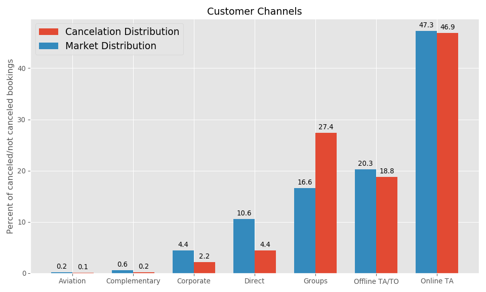

Milestone Report: Predicting Hotel Cancellations
================
Matthew Merrill

# Project Proposal

My project will seek to solve a common but surging issue for the hotel
industry, predicting cancellations and maintaining brand integrity among
surging customer interest in booking through online travel agents,
rather than direct. According to a study conducted by D-Edge Hospitality
Solutions, cancellation rates in the hotel industry increased more than
8 percent from 2014 to 2017\[1\]

The impact on the industry has come from pressure primarily stemming
from online travel agencies and their adoption of ‘Risk Free
Reservations’. While OTA’s use cancellations as a way to expand their
market availability and retain customer loyalty, hotels risk the ability
to forecast revenue and maintain brand integrity in the process\[2\]

Hotels often desire to create a personalized ease of service for
customers from the moment of booking, but OTA’s want their customers to
adopt a ‘book now, ask questions later’ mentality. The preference for
customers often falls towards the OTA’s, because they will often
advertise a lower price than booking direct, as they absorb the
cancellation risk, which creates a strain on the hotels’ customer
relationship and diminishes the booking experience. While OTA’s do draw
in customers and expand outreach for hotels, there is an opportunity to
optimize customer channels and lower risk, while increasing real-time
income.

The outcome of this project will give the client insights into
predicting cancellations and provide suggestions for modifying their
cancellation policy. This will provide the hotel with the ability to
optimize customer channels, maintain brand integrity and increase
customer loyalty.

The dataset was obtained from [Science
Direct](https://www.sciencedirect.com) and contains a collection of
observations taken from 2015 to 2017 of guest bookings for two hotels,
both located in Portugal. The data was collected directly from the
hotels’ PMS (property management system) database and was relatively
clean and structured upon retrieval. Each observation represents a
booking, with the variables capturing details including when it was
booked, dates of stay, through which operator the guest chose to go
through, if that booking was cancelled and the average daily rate. Once
this project is complete, I will be able to provide insights on the
following questions:

> Can we predict when and if a guest may cancel a reservation? What
> inferences can we make that would help optimize customer channels and
> lower the overall risk? What customers should we be targeting to book
> directly through the hotel?

I will attempt to solve this problem by investigating where
cancellations primarily occur and during what time of the year. After
drawing insights from the exploratory data analysis phase, the dataset
will be modified for the modeling process with the goal of predicting
the cancelation column of the set. Insights from the model and from the
exploratory phase will lead to suggestions to the client that will help
them forecast cancellations and optimize customer channels as mentioned
above.

The client will receive the working model in the form of a web
application as well as a summary paper and slide deck. The slide deck
will summarize the findings and attempt to “sell” the work to the
client, and the paper will summarize the details. Code will be provided
for inspection and reproducibility for the client.

# Data Wrangling and Cleaning Steps

The data I obtained was relatively clean to begin with, however there
were a few instances of “NULL” and empty entries as well as mislabeled
entries that needed clarification. The convention for null data was a
string with 7 spaces before NULL (“NULL”), so this was found and
replaced with `numpy`’s NAN entry for ease of identification. At this
point it was a matter of understanding the data to replace NAN values
with appropriate labels for the variable.

The variables with NAN entries were the company, agent and country
columns. Upon more exploration of the data and its source website, it
was discovered that for company and agent, null entries correlated to
customers that did not go through a company or agent to book. To correct
this, the original company and agent names were replaced with string
numerics to protect anonymity so to continue with this convention, nan
entries were replaced with “0” to represent “no agent” or “no company”.
The country column had no added clarification for the nan entries, so it
was decided that “UNK” for unknown would be used instead.

The last step for cleaning was to create a datetime column for a guest’s
date of arrival. The data provided the day, month and year separately
for arrival, so these were combined and converted to datetime format to
allow more versatility in analysis.

Lastly, the data was explored to identify any outliers that may skew
analysis. A few peculiar entries were found. For example, one group
booked 2 years in advance and one brought 10 children and 10 kids, one
guest also had 26 previous cancellations. Upon further exploration there
was no clear evidence to rule out these observations, so no steps were
taken to alter these data.

The code below highlights the data wrangling part. I have carried out
the analysis in the RStudio IDE which also allows me to use Python code
using the `reticulate` package.

``` r
library(tidyverse)
library(reticulate)
```

Read in the data.

``` python
import pandas as pd
import numpy as np
import matplotlib.pyplot as plt
plt.style.use('ggplot')
import seaborn as sns
import os
hotels = pd.read_csv('https://raw.githubusercontent.com/rfordatascience/tidytuesday/master/data/2020/2020-02-11/hotels.csv')

hotels.describe(exclude=[np.number]).T
```

    ##                           count unique         top    freq
    ## hotel                    119390      2  City Hotel   79330
    ## arrival_date_month       119390     12      August   13877
    ## meal                     119390      5          BB   92310
    ## country                  118902    177         PRT   48590
    ## market_segment           119390      8   Online TA   56477
    ## distribution_channel     119390      5       TA/TO   97870
    ## reserved_room_type       119390     10           A   85994
    ## assigned_room_type       119390     12           A   74053
    ## deposit_type             119390      3  No Deposit  104641
    ## customer_type            119390      4   Transient   89613
    ## reservation_status       119390      3   Check-Out   75166
    ## reservation_status_date  119390    926  2015-10-21    1461

``` python
hotels.describe(include=[np.number]).T
```

    ##                                    count         mean  ...     75%     max
    ## is_canceled                     119390.0     0.370416  ...     1.0     1.0
    ## lead_time                       119390.0   104.011416  ...   160.0   737.0
    ## arrival_date_year               119390.0  2016.156554  ...  2017.0  2017.0
    ## arrival_date_week_number        119390.0    27.165173  ...    38.0    53.0
    ## arrival_date_day_of_month       119390.0    15.798241  ...    23.0    31.0
    ## stays_in_weekend_nights         119390.0     0.927599  ...     2.0    19.0
    ## stays_in_week_nights            119390.0     2.500302  ...     3.0    50.0
    ## adults                          119390.0     1.856403  ...     2.0    55.0
    ## children                        119386.0     0.103890  ...     0.0    10.0
    ## babies                          119390.0     0.007949  ...     0.0    10.0
    ## is_repeated_guest               119390.0     0.031912  ...     0.0     1.0
    ## previous_cancellations          119390.0     0.087118  ...     0.0    26.0
    ## previous_bookings_not_canceled  119390.0     0.137097  ...     0.0    72.0
    ## booking_changes                 119390.0     0.221124  ...     0.0    21.0
    ## agent                           103050.0    86.693382  ...   229.0   535.0
    ## company                           6797.0   189.266735  ...   270.0   543.0
    ## days_in_waiting_list            119390.0     2.321149  ...     0.0   391.0
    ## adr                             119390.0   101.831122  ...   126.0  5400.0
    ## required_car_parking_spaces     119390.0     0.062518  ...     0.0     8.0
    ## total_of_special_requests       119390.0     0.571363  ...     1.0     5.0
    ## 
    ## [20 rows x 8 columns]

Cleaning the unmentionables.

``` python
# convert 'NULL' entries to np.nan
cols = ['agent', 'company']
for col in cols:
    for i in range(len(hotels[col])):
        if (hotels[col].iloc[i] == '       NULL'):
            hotels[col].iloc[i] = np.nan
        else:
            continue
```

``` python
# Insert 0 for each missing Children entry and convert to integer.
hotels.children = pd.to_numeric(hotels.children.replace(np.nan, 0), downcast = 'integer')
```

``` python
# Convert missing values for Company and Agent to 0, meaning 'no agent' and 'no company'.
cols = ['company', 'agent']
for col in cols:
        hotels[col] = hotels[col].replace(np.nan, '0')
```

``` python
# If country of origin is missing, replace as 'UNK' for unknown.
hotels['country'] = hotels['country'].replace(np.nan, 'UNK')
```

``` python
# convert reservation_status_date to datetime
hotels['reservation_status_date'] = pd.to_datetime(hotels['reservation_status_date'])
```

``` python
hotels.name = 'Hotels'
null_data = hotels[hotels.isnull().any(axis=1)]
if null_data.empty:
    print(hotels.name + ' contains no null values')
else:
    print(hotels.name + ' does contain null values')
```

    ## Hotels contains no null values

# Exploratory Data Analysis

``` python
fig, ax = plt.subplots(figsize=(10, 6))
hotels.market_segment.value_counts().plot.bar(ax=ax)
ax.set_xlabel('Market Segment')
ax.set_ylabel('Count')
ax.set_title('Booking source', fontsize = 15, weight = 'bold')
for tick in ax.get_xticklabels():
    tick.set_rotation(45)
plt.show()
```

<!-- -->

# Exploratory Data Analysis:

Before beginning data analysis it was hypothesised that over time,
customer bookings from online travel agencies increase along with the
portion of cancellations from these bookings. I followed up with asking
a number of questions to gain insight into other variables and factors
that may contribute to my proposal.

### Initial findings of numeric columns:

  - About 25% of bookings from 2015 to 2017 were cancelled
  - 50% of bookings occurred between the 16th and 38th week of the year.
  - The median lead time is 69 with an IQR of 142
  - Guests typically do not spend any time on a waiting list, but the
    max was 391 days.
  - The average daily rate (ADR) was about 94.5 with a max of 5400.

### Initial findings of categorical columns:

  - August is the most popular month between both hotels.
  - Most people who visit are from Portugal (the country where both
    hotels are located).
  - Most bookings are made with an online travel agent.
  - Most bookings are made with travel agent ‘9.0’.
  - Most people do not go through a
company.

### What is the most common means of booking? Through which booking channel do most cancellations occur?

  - It was found that 47% of bookings between both hotels originated
    from OTAs.
  - Of those who booked through an OTA, 37% cancelled.
  - Of all cancellations, regardless of booking channel, 47% came from
    OTAs.

This compares sharply to customers who booked direct, with only 11% of
bookings from 2015 to 2017 occuring direct with only 15% of those
customers
cancelling.

### How have the rate of cancellations changed over time relative to how the market segment has changed?

#### In 2015…

  - 28% of bookings were through an online travel agency and 27% of
    those were cancelled.
  - 37% of all bookings were cancelled.
  - 20% of cancellations were from online travel agency bookings.

#### In 2016…

  - 49% of bookings were through an online travel agency and 36% of
    those were cancelled.
  - 36% of all bookings were cancelled.
  - 48% of cancellations were from online travel agency bookings.

#### In 2017…

  - 56% of bookings were through an online travel agency and 41% of
    those were cancelled.
  - 39% of all bookings were cancelled.
  - 59% of cancellations were from online travel agency bookings.

Bookings from online travel agencies increased from 28% to 56% from 2015
to 2017. During that time, cancellations increased from 37% to 39%, with
cancellations from OTA’s increasing from 27% to 41%.

### Does lead time correlate to cancellations?

``` python
canceled = hotels[hotels.is_canceled == 1]
not_canceled = hotels[hotels.is_canceled == 0]
```

``` python
red_point = dict(markerfacecolor='r', marker='p')
# boxplot of lead time for canceled and not canceled bookings
fig, ax = plt.subplots(2, figsize=(10, 4), sharex=True, sharey=True, gridspec_kw={'hspace': 0})
ax[0].boxplot(canceled.lead_time, vert=False, flierprops=red_point)
```

    ## {'whiskers': [<matplotlib.lines.Line2D object at 0x1a1f0ea390>, <matplotlib.lines.Line2D object at 0x1a1ef67810>], 'caps': [<matplotlib.lines.Line2D object at 0x1a1f0f4750>, <matplotlib.lines.Line2D object at 0x1a1f0f4c50>], 'boxes': [<matplotlib.lines.Line2D object at 0x1a1f0ea6d0>], 'medians': [<matplotlib.lines.Line2D object at 0x1a1f0fb750>], 'fliers': [<matplotlib.lines.Line2D object at 0x1a1f0fb690>], 'means': []}

``` python
ax[1].boxplot(not_canceled.lead_time, vert=False, flierprops=red_point)
```

    ## {'whiskers': [<matplotlib.lines.Line2D object at 0x1a1f0eadd0>, <matplotlib.lines.Line2D object at 0x1a1f1047d0>], 'caps': [<matplotlib.lines.Line2D object at 0x1a1f104cd0>, <matplotlib.lines.Line2D object at 0x1a1f10e210>], 'boxes': [<matplotlib.lines.Line2D object at 0x1a1f0eab50>], 'medians': [<matplotlib.lines.Line2D object at 0x1a1f10ecd0>], 'fliers': [<matplotlib.lines.Line2D object at 0x1a1f10ec10>], 'means': []}

``` python
ax[0].set_title('Canceled')
ax[1].set_title('Not Canceled')
ax[1].set(xlabel='Lead Time')
plt.show()
```

<!-- -->

``` python
median_lead_canc = np.median(canceled.lead_time)
median_lead_not_canc = np.median(not_canceled.lead_time)
```

  - The median lead time for canceled bookings is 113
  - The median lead time for not canceled bookings is 45

The average lead time for canceled bookings is 2.5 times greater on
average than for those who did not cancel. It may be that people booking
far out are looking for better deals, or other options opening up may be
more likely given a larger lead
time.

### Do people who book through online travel agencies have larger median lead times?

``` python
# define lead time for ota's and non-ota
ta_lead_time = hotels[hotels.market_segment == 'Online TA']['lead_time']
not_ta_lead_time = hotels[hotels.market_segment != 'Online TA']['lead_time']

# plot hist of lead time for canceled and non-canceled guests
fig, ax = plt.subplots(2, figsize=(10, 4), sharex=True, sharey=True, gridspec_kw={'hspace': 0})
ax[0].boxplot(ta_lead_time, vert=False, flierprops=red_point)
```

    ## {'whiskers': [<matplotlib.lines.Line2D object at 0x1a20d20c50>, <matplotlib.lines.Line2D object at 0x1a228355d0>], 'caps': [<matplotlib.lines.Line2D object at 0x1a235bc0d0>, <matplotlib.lines.Line2D object at 0x1a235bc5d0>], 'boxes': [<matplotlib.lines.Line2D object at 0x1a20d20fd0>], 'medians': [<matplotlib.lines.Line2D object at 0x1a1ef62310>], 'fliers': [<matplotlib.lines.Line2D object at 0x1a235c4050>], 'means': []}

``` python
ax[1].boxplot(not_ta_lead_time, vert=False, flierprops=red_point)
```

    ## {'whiskers': [<matplotlib.lines.Line2D object at 0x1a235c49d0>, <matplotlib.lines.Line2D object at 0x1a235d0050>], 'caps': [<matplotlib.lines.Line2D object at 0x1a235d0510>, <matplotlib.lines.Line2D object at 0x1a235d0a10>], 'boxes': [<matplotlib.lines.Line2D object at 0x1a235b8210>], 'medians': [<matplotlib.lines.Line2D object at 0x1a235d8510>], 'fliers': [<matplotlib.lines.Line2D object at 0x1a235d8450>], 'means': []}

``` python
ax[0].set_title('OTA Lead Time')
ax[1].set_title("Lead Time from non-OTA's")
ax[1].set(xlabel = 'Lead Time')
plt.show()
```

<!-- -->

``` python
median_lead_ota = np.median(hotels.lead_time)
median_lead_not_ota = np.median(hotels.market_segment != 'Online TA')
```

  - The median lead time for OTA bookings was 113
  - The median lead time for all other methods of booking was 113

Online travel agencies do not have a higher lead time on average, there
may be another area here to explore. Lead time and bookings from OTA’s
seem to correlate to higher rates of
cancellation.

### How have distribution channels changed over time?

``` python
hotels_2015 = hotels[(hotels.arrival_date_year  == 2015) & (hotels.market_segment != 'Undefined') & (hotels.market_segment != 'Aviation')]
hotels_2016 = hotels[(hotels.arrival_date_year  == 2016) & (hotels.market_segment != 'Undefined') & (hotels.market_segment != 'Aviation')]
hotels_2017 = hotels[(hotels.arrival_date_year  == 2017) & (hotels.market_segment != 'Undefined') & (hotels.market_segment != 'Aviation')]
```

``` python
# plot hist per week for arrival_date_week_number
labels = hotels_2015.market_segment.unique()
x = np.arange(len(labels))  # the label locations
width = 0.25  # the width of the bars

ms_2015 = round(hotels_2015.market_segment.value_counts(normalize = True, sort=False), 2)
ms_2016 = round(hotels_2016.market_segment.value_counts(normalize = True, sort=False), 2)
ms_2017 = round(hotels_2017.market_segment.value_counts(normalize = True, sort=False), 2)

fig, ax = plt.subplots(figsize=(10, 5))
year_2015 = ax.bar(x - width, ms_2015, width, label='2015')
year_2016 = ax.bar(x, ms_2016, width, label='2016')
year_2017 = ax.bar(x + width, ms_2017, width, label='2017')

# Add some text for labels, title and custom x-axis tick labels, etc.
ax.set_ylabel('Bookings')
ax.set_title('Changing Customer Channels (City and Resort)')
ax.set_xticks(x)
```

    ## [<matplotlib.axis.XTick object at 0x1a214e3ed0>, <matplotlib.axis.XTick object at 0x1a214e3710>, <matplotlib.axis.XTick object at 0x1a214fa250>, <matplotlib.axis.XTick object at 0x1a215064d0>, <matplotlib.axis.XTick object at 0x1a21506a50>, <matplotlib.axis.XTick object at 0x1a2150d190>]

``` python
ax.set_xticklabels(labels)
```

    ## [Text(0, 0, 'Direct'), Text(0, 0, 'Corporate'), Text(0, 0, 'Online TA'), Text(0, 0, 'Offline TA/TO'), Text(0, 0, 'Complementary'), Text(0, 0, 'Groups')]

``` python
ax.legend()

def autolabel(rects):
    """Attach a text label above each bar in *rects*, displaying its height."""
    for rect in rects:
        height = rect.get_height()
        ax.annotate('{}'.format(height),
                    xy=(rect.get_x() + rect.get_width() / 2, height),
                    xytext=(0, 3),  # 3 points vertical offset
                    textcoords="offset points",
                    ha='center', va='bottom')


autolabel(year_2015)
autolabel(year_2016)
autolabel(year_2017)


fig.tight_layout()

plt.show()
```

<!-- -->

``` python
# list of data by year
data = [hotels_2015, hotels_2016, hotels_2017]
loc = ['City Hotel', 'Resort Hotel']
pct = []
for hotel in data:
    ms = hotel.groupby(['hotel', 'market_segment']).agg({'market_segment': 'count'})
    ms_pct = ms.groupby(level=0).apply(lambda x: 100 * x / float(x.sum()))
    for place in loc:
      pct.append(round(ms_pct.loc[place].loc['Online TA'].values[0], 1))
```

Percentage of bookings from OTAs for city hotel: - % in 2015. - 37.3% in
2016. - 42.8% in 2017. Percentage of bookings from OTAs for resort
hotel: - 22.4% in 2015. - 51.8% in 2016. - 58.3% in 2017.

In 2015, the city hotel received 22% of it’s bookings through OTAs while
the resort hotel received 37%. By 2017, city hotel recieved 58% of its
bookings through an online TA with the resort hotel increasing their
portion to 51%. It is clear that both increased significantly over time
with the city hotel taking a major leap from 2015 to 2016, increasing
from 22% to
52%.

### Are guests with kids more likely to cancel?

``` python
# Calculate number of guests with babies who canceled and who did not cancel
babies = hotels.loc[(hotels.babies != 0)]['babies'].count()
not_canceled_babies = hotels.loc[(hotels.is_canceled == 0) & (hotels.babies != 0)]['babies'].count()

# Do the same calculation for famalies with children and with no children
children = hotels.loc[(hotels.children != 0)]['children'].count()
not_canceled_children = hotels.loc[(hotels.is_canceled == 0) & (hotels.children != 0)]['children'].count()

# No children
conditions = (hotels.children == 0) & (hotels.babies == 0)
no_kids = hotels.loc[conditions]['adults'].count()
not_canceled_no_kids = hotels.loc[(hotels.is_canceled == 0) & (conditions)]['adults'].count()
```

``` python
# percentage of famalies who did not cancel
perc_babies = str(round(not_canceled_babies/babies, 2)*100) + '%'
perc_children = str(round(not_canceled_children/children, 2)*100) + '%'
perc_no_kids = str(round(not_canceled_no_kids/no_kids, 2)*100) + '%'
```

``` python
d1 = {'guest_type': ['babies', 'children', 'without_children'], \
     'not_cancled': [not_canceled_babies, not_canceled_children, not_canceled_no_kids],\
    'percent': [perc_babies, perc_children, perc_no_kids]}

d = {'guest_type': ['Babies', 'Children', 'No Kids'], \
    'percent': [perc_babies, perc_children, perc_no_kids]}

pie_data = pd.DataFrame(data=d)
```

``` python
import re

def donut_plot(data, plotnumber):
    # create donut plots
    startingRadius = 0.7 + (0.3* (len(data)-1))
    for index, row in data.iterrows():
        scenario = row["guest_type"]
        percentage = row["percent"]
        textLabel = scenario
        
        percentage = int(re.search(r'\d+', percentage).group())
        remainingPie = 100 - percentage
        
        donut_sizes = [remainingPie, percentage]
        
        plt.text(0.01, startingRadius - 0.25, textLabel, ha='right', va='bottom', fontsize = 12, 
        fontweight = 'bold')
        
        plt.pie(donut_sizes, radius=startingRadius, startangle=0, colors=['lightgray', 'tomato'],
                wedgeprops={"edgecolor": "white", 'linewidth': 1.5})
        
        startingRadius-=0.3

    # equal ensures pie chart is drawn as a circle (equal aspect ratio)
    plt.axis('equal')

    # create circle and place onto pie chart
    circle = plt.Circle(xy=(0, 0), radius=0.35, facecolor='white')
    plt.gca().add_artist(circle)
    plt.show()
```

``` python
# plot the proportion of cancellations based on whether guests had babies, children or none.
plt.title('82% of guests with babies \n did not cancel \n', fontsize = '18', fontweight = 'bold')
donut_plot(pie_data, '1')
```

<!-- -->

Guests with babies followed through with their booking 83% of the time
and 86% of guests who stayed with babies had at least one special
request.

### How do the number of stays vary by month based on family size?

``` python
#The first thing to do is create a dataframe filtered for non-canceled hotel stays
#Prior to that convert children to a categorical variable
hotels['kids'] = hotels.children + hotels.babies

hotels = (hotels.assign(kids = lambda df: df.kids.map(
                    lambda kids: 'kids' if kids > 0 else 'none')))
```

``` python
#How do the hotel stays of guests with/without children vary throughout the year? 
#Is this different in the city and the resort hotel?

# Map months of the year to numeric values to create arrival date column for exploration
d = {'July':7, 'August':8, 'September':9, 'October':10, 'November':11, 'December':12, 'January':1, 'February':2, 'March':3, 'April':4, 'May': 5, 'June':6}
hotels.arrival_date_month = hotels.arrival_date_month.map(d)

#Recreated plot from tidy tuesday 

df = (
      hotels
          .groupby(['hotel', 'arrival_date_month', 'kids'])
          .size()
          .groupby(level=[0,2])
          .apply(lambda x: x/x.sum())
          .reset_index()
      )

df.rename(columns = {0:'count'}, inplace=True)

from plotnine import *

ggplot(df, aes(x = 'arrival_date_month', y = 'count', fill = 'kids')) + \
    geom_col(position='dodge') + facet_wrap(['hotel'], nrow = 2) + \
    ggtitle("Percent Distribution of Guests with and without Kids")
```

    ## <ggplot: (7020659985)>

<!-- --> Between
both hotels, a majority of guests come without babies or children. Out
of the year however, it is easy to predict when families will arrive,
between both hotels families typically arrived in the summer months.
This could be an opportunity to explore for each hotel.

### How does the average daily rate change with family size?

``` python
kids_condition = (hotels['children'] !=0) | (hotels['babies'] != 0)
kids_per_guest = hotels[['hotel','adr','adults', 'babies', 'children']]
kids_per_guest['kids'] = kids_per_guest['babies'] + kids_per_guest['children']

# Filter out guests with more than 3 kids to eliminate outliers.
```

    ## /Users/mattmerrill/opt/anaconda3/bin/python3:1: SettingWithCopyWarning: 
    ## A value is trying to be set on a copy of a slice from a DataFrame.
    ## Try using .loc[row_indexer,col_indexer] = value instead
    ## 
    ## See the caveats in the documentation: http://pandas.pydata.org/pandas-docs/stable/user_guide/indexing.html#returning-a-view-versus-a-copy

``` python
kids_per_guest = kids_per_guest[kids_per_guest['kids'] <= 3]
```

``` python
# plot average daily rate based on number of kids (babies and children combined) without adr outliers
g = sns.catplot(x="hotel",
y="adr", data=kids_per_guest, kind="box", hue = "kids", showfliers = False)
plt.show()
```

<!-- --> - The
average revenue increases on average as family size increases for both
hotels.

The average revenue increases on average as family size increases for
both hotels. After exploring the data, it is clear that my hypothesis
has been confirmed. The use of online travel agencies and cancelations
increased, reaching a peak in the last year of the data with 56% of
guests booking through an OTA and 41% of all guests canceling (up from
28% and 20%, respectively). However, there were some surprising insights
gained as well. Customers who cancel typically have a longer lead time.
Although most cancellations come from customers who book through an OTA,
their average lead time is shorter than for other means of booking. This
means lead time may be another likely factor in determining
cancellations. Guests who booked with at least one baby were more likely
to follow through with the booking and were more likely to require
accommodations. The average daily rate increases with each added child
to the itinerary. Guests with kids represent a small portion of guests
for both hotels, suggesting an untapped market. In conclusion, customers
who book through an online travel agency, and those who book with a
larger lead time are more likely to cancel. It seems that the trends in
customer preference for online booking are directly correlated with an
increase in cancellations. This leads me to believe that the market is
seeking the flexibility and freedoms that come from risk free booking
with OTAs. There are however a number of areas to continue exploring and
confirm through statistical analysis. How confident can I be in this
conclusion? The sample size for families is quite small, could their low
rate of cancellation be due to the small sample size? How confident can
I be in identifying lead time as a major factor in deciding
cancellations?

# Statistical Analysis

Exploratory analysis revealed a number of potential predicting factors
to determine if a guest will cancel. We can see that guests are more
likely to cancel if they are from an OTA or book with a larger lead
time, and guests with babies are far less likely to cancel. We want to
now consider what other variables may contribute to cancellations, such
as ‘agent’, ‘distribution\_channel’, ‘is\_repeated\_guest’, ‘country’,
‘arrival\_date\_month’, ‘kids’ and ‘hotel’. Since this variable is
categorical in nature, my approach will utilize the chi-squared test for
inferential analysis. To perform the chi-squared test, we create a
contingency table of observed values and calculate the expected
frequencies assuming the null hypothesis. Following this we calculate
the chi-squared statistic with the following formula:

\[\chi^2 = \sum_\ \frac{(O - E)^2}{E}\] Once this statistic is
calculated, we compare it to the critical values of the chi-squared
distribution, calculated with the degrees of freedom and the certainty
level (we use the 95% convention). Assuming the null hypothesis is true,
we can reject it if our test statistic is greater than our critical
value. Below is an analysis of each of the identified variables with the
result.

``` python
# import appropriate modules
from scipy.stats import chisquare
from scipy.stats import chi2
from scipy.stats import chi2_contingency
from scipy.stats import norm
from scipy.stats import t
from numpy.random import seed
from scipy import stats
```

``` python
# define function to output chi-squared test and results
def chi2results(var1, var2, prob):
    observed = pd.crosstab(var1, var2)
    chi_square, p_val, dof, expected = chi2_contingency(observed)
    critical = chi2.ppf(prob, dof)
    
    if abs(chi_square) >= critical:
        result = 'Dependent (reject H0)'
    else:
        result = 'Independent (fail to reject H0)'
    alpha = 1.0 - prob
    
    return chi_square, critical, p_val, dof, alpha, result
```

``` python
observed = pd.crosstab(hotels.is_canceled, hotels.market_segment)
print(observed)
```

    ## market_segment  Aviation  Complementary  ...  Online TA  Undefined
    ## is_canceled                              ...                      
    ## 0                    185            646  ...      35738          0
    ## 1                     52             97  ...      20739          2
    ## 
    ## [2 rows x 8 columns]

``` python
# set columns to test
cat_cols = list(hotels.describe(exclude=[np.number]).columns)
test_col = 'is_canceled'

# Creating an empty Dataframe with column names only
chi_square_results = pd.DataFrame(columns=['chi_square', 'critical_val', 'p_val', \
                                            'dof', 'alpha', 'result'], index = cat_cols)
for col in cat_cols:
    res = chi2results(hotels[test_col], hotels[col], prob = 0.95)
    chi_square_results.loc[col] = [res[0], res[1], res[2], res[3], res[4], res[5]]

print(chi_square_results[['p_val', 'result']])
```

    ##                                 p_val                 result
    ## hotel                               0  Dependent (reject H0)
    ## meal                      1.32124e-64  Dependent (reject H0)
    ## country                             0  Dependent (reject H0)
    ## market_segment                      0  Dependent (reject H0)
    ## distribution_channel                0  Dependent (reject H0)
    ## reserved_room_type       1.12196e-133  Dependent (reject H0)
    ## assigned_room_type                  0  Dependent (reject H0)
    ## deposit_type                        0  Dependent (reject H0)
    ## agent                               0  Dependent (reject H0)
    ## company                  1.73552e-297  Dependent (reject H0)
    ## customer_type                       0  Dependent (reject H0)
    ## reservation_status                  0  Dependent (reject H0)
    ## reservation_status_date             0  Dependent (reject H0)
    ## kids                      1.06631e-05  Dependent (reject H0)

The null hypothesis is rejected for each of the tested columns,
suggesting an association with cancellations for each variable.

``` python
num_cols = list(hotels.describe(include=[np.number]).columns)
print(num_cols)
```

    ## ['is_canceled', 'lead_time', 'arrival_date_year', 'arrival_date_month', 'arrival_date_week_number', 'arrival_date_day_of_month', 'stays_in_weekend_nights', 'stays_in_week_nights', 'adults', 'children', 'babies', 'is_repeated_guest', 'previous_cancellations', 'previous_bookings_not_canceled', 'booking_changes', 'days_in_waiting_list', 'adr', 'required_car_parking_spaces', 'total_of_special_requests']

``` python
mean = np.mean(hotels['adr'])
std = np.std(hotels['adr'], ddof = 1)
_ = plt.hist(hotels['adr'], bins = 40, range = (0, 500))
_ = plt.xlabel('Average Daily Rate (adr)')
_ = plt.ylabel('frequency')
_ = plt.axvline(mean, color='r')
_ = plt.axvline(mean+std, color='r', linestyle='--')
_ = plt.axvline(mean-std, color='r', linestyle='--')
_ = plt.show()
```

<!-- -->

``` python
print('mean charges ' + str(round(mean, 2)))
```

    ## mean charges 101.83

``` python
print('stadndard deviation ' + str(round(std, 2)))
```

    ## stadndard deviation 50.54

The null hypothesis for the average daily rate is that is has no
influence on whether or not a booking is likely to be canceled.

``` python
# Define samples
sample0 = hotels[hotels.is_canceled == 1]['adr']
sample1 = hotels[hotels.is_canceled == 0]['adr']
n_0 = len(sample0)
n_1 = len(sample1)
# Define mean and standard deviation for each group
x_0 = np.mean(sample0)
x_1 = np.mean(sample1)
s_0 = np.std(sample0, ddof = 1)
s_1 = np.std(sample1, ddof = 1)
# degrees of freedom
df = n_0 + n_1 - 2
```

``` python
t, pval = stats.ttest_ind_from_stats(x_0, s_0, n_0, x_1, s_1, n_1)

print(t, pval)
```

    ## 16.45063928773002 9.68293418006015e-61

The results reject the null hypothesis. The confidence interval is far
greater than the accepted 95% needed to accept this outcome. Thus we can
conclude that the average daily rate is important in determining if a
booking will be canceled.

``` python
def significance(col):
  ''' this function will return the t-stat and pval of a feature of interest '''
  # Define samples
  sample0 = hotels[hotels.is_canceled == 1][col]
  sample1 = hotels[hotels.is_canceled == 0][col]
  n_0 = len(sample0)
  n_1 = len(sample1)
  # Define mean and standard deviation for each group
  x_0 = np.mean(sample0)
  x_1 = np.mean(sample1)
  s_0 = np.std(sample0, ddof = 1)
  s_1 = np.std(sample1, ddof = 1)
  # degrees of freedom
  df = n_0 + n_1 - 2
  
  t, pval = stats.ttest_ind_from_stats(x_0, s_0, n_0, x_1, s_1, n_1)
  
  if pval <= 0.05:
      result = 'Dependent (reject H0)'
  else:
      result = 'Ind (fail to reject H0)'
    
  return t, pval, result
```

``` python
num_cols = list(hotels.describe(include=[np.number]).columns)

# Creating an empty Dataframe with column names only
t_stat_results = pd.DataFrame(columns=['t_stat', 'p_val', 'result'], index = num_cols)

for col in num_cols:
  res = significance(col)
  t_stat_results.loc[col] = [res[0], res[1], res[2]]

print(t_stat_results)
```

    ##                                   t_stat         p_val                   result
    ## is_canceled                          inf             0    Dependent (reject H0)
    ## lead_time                        105.935             0    Dependent (reject H0)
    ## arrival_date_year                5.75721   8.57249e-09    Dependent (reject H0)
    ## arrival_date_month               3.80854   0.000139859    Dependent (reject H0)
    ## arrival_date_week_number         2.81546    0.00487155    Dependent (reject H0)
    ## arrival_date_day_of_month       -2.11814     0.0341653    Dependent (reject H0)
    ## stays_in_weekend_nights        -0.618864      0.536007  Ind (fail to reject H0)
    ## stays_in_week_nights             8.55944   1.14733e-17    Dependent (reject H0)
    ## adults                           20.7749   1.07857e-95    Dependent (reject H0)
    ## children                         1.74018     0.0818304  Ind (fail to reject H0)
    ## babies                          -11.2324   2.92302e-29    Dependent (reject H0)
    ## is_repeated_guest               -29.4042  2.31271e-189    Dependent (reject H0)
    ## previous_cancellations           38.2866             0    Dependent (reject H0)
    ## previous_bookings_not_canceled  -19.8512   1.48947e-87    Dependent (reject H0)
    ## booking_changes                 -50.4156             0    Dependent (reject H0)
    ## days_in_waiting_list             18.7501   2.50357e-78    Dependent (reject H0)
    ## adr                              16.4506   9.68293e-61    Dependent (reject H0)
    ## required_car_parking_spaces     -68.8786             0    Dependent (reject H0)
    ## total_of_special_requests       -83.4092             0    Dependent (reject H0)

# Machine Learning

``` python
cat_features = chi_square_results.index.to_list()
num_features = t_stat_results[t_stat_results['result'] != 'Ind (fail to reject H0)'].index.to_list()
features = cat_features + num_features
```

Split data into features and label

``` python
# load appropriate modules
from numpy import array
from sklearn.preprocessing import LabelEncoder
from sklearn.preprocessing import OneHotEncoder

X = hotels[features].drop('is_canceled', axis=1)
        
# Dummy coding
y = hotels['is_canceled']

# Dummy coding for col in cols
dummy_cols = ['market_segment', 'distribution_channel', 'hotel', 'kids', 'reserved_room_type', 'meal', 'assigned_room_type', 'deposit_type', 'customer_type', 'reservation_status']
transformed = []
for col in dummy_cols:
  X[col] = pd.get_dummies(X[col])

# Label Encoder
enc_cols = ['country', 'agent', 'company', 'reservation_status_date']
for col in enc_cols:
  data = hotels[col].to_list()
  values = array(data)
  # initialize labelencoder, fit and transform
  label_encoder = LabelEncoder()
  integer_encoded = label_encoder.fit_transform(values)
  transformed.append(integer_encoded)
  # Drop country column and replace with encoded 
  X.drop(col, axis = 1, inplace = True)
  X[col] = integer_encoded

print(X.head())
```

    ##    hotel  meal  market_segment  ...  agent  company  reservation_status_date
    ## 0      0     1               0  ...      0        0                      121
    ## 1      0     1               0  ...      0        0                      121
    ## 2      0     1               0  ...      0        0                      122
    ## 3      0     1               0  ...    157        0                      122
    ## 4      0     1               0  ...    103        0                      123
    ## 
    ## [5 rows x 30 columns]

Perform logistic regression

``` python
from sklearn.model_selection import train_test_split
from sklearn.linear_model import LogisticRegression
from sklearn.preprocessing import StandardScaler
from sklearn.pipeline import Pipeline
from sklearn.metrics import accuracy_score

#scaler in pipeline object, use logreg algorith
steps = [('scaler', StandardScaler()), \
         ('logreg', LogisticRegression(max_iter=200))]
pipeline = Pipeline(steps)

logreg = LogisticRegression()
X_train, X_test, y_train, y_test = \
    train_test_split(X.values, y.values, test_size=0.3, random_state=3)

# fit on training set
logreg_scaled = pipeline.fit(X_train, y_train)
# predict on test set
y_pred = pipeline.predict(X_test)
accuracy_score(y_test, y_pred)
```

    ## 0.9899489069436301

``` python
def display_plot(cv_scores, cv_scores_std):
    '''This function will plot the r squared 
    score as well as standard error for each alpha'''
    fig = plt.figure()
    ax = fig.add_subplot(1,1,1)
    ax.plot(alpha_space, cv_scores)

    std_error = cv_scores_std / np.sqrt(10)

    ax.fill_between(alpha_space, cv_scores + std_error, \
                    cv_scores - std_error, alpha=0.2)
    ax.set_ylabel('CV Score +/- Std Error')
    ax.set_xlabel('Alpha')
    ax.axhline(np.max(cv_scores), linestyle='--', color='.5')
    ax.set_xlim([alpha_space[0], alpha_space[-1]])
    ax.set_xscale('log')
    plt.show()
```

Perform ridge regression and plot

``` python
from sklearn.linear_model import Ridge
from sklearn.model_selection import cross_val_score
# Setup the array of alphas and lists to store scores
alpha_space = np.logspace(-4, 3, 50)
ridge_scores = []
ridge_scores_std = []

# Create a ridge regressor: ridge
ridge = Ridge(normalize=True)

# Compute scores over range of alphas
for alpha in alpha_space:

    # Specify the alpha value to use: ridge.alpha
    ridge.alpha = alpha
    
    # Perform 10-fold CV: ridge_cv_scores
    ridge_cv_scores = cross_val_score(ridge, X.values, y.values, cv = 5)
    
    # Append the mean of ridge_cv_scores to ridge_scores
    ridge_scores.append(np.mean(ridge_cv_scores))
    
    # Append the std of ridge_cv_scores to ridge_scores_std
    ridge_scores_std.append(np.std(ridge_cv_scores))

# Display the plot
display_plot(ridge_scores, ridge_scores_std)
```

<!-- -->

``` python
# Lasso for feature selection in scikit learn
#store feature names
from sklearn.linear_model import Lasso
names = X.columns
lasso = Lasso(alpha=1)
# extract coef attribute and store
lasso_coef = lasso.fit(X, y).coef_
_ = plt.figure(figsize=(20,10))
_ = plt.plot(range(len(names)), lasso_coef)
_ = plt.xticks(range(len(names)), names, rotation=45)
_ = plt.ylabel('Coefficients')
plt.show()
```

<!-- -->

``` python
from sklearn.metrics import roc_auc_score
from sklearn import preprocessing
from sklearn.metrics import roc_curve

# plotting the ROC curve
y_pred_prob = pipeline.predict_proba(X_test)[:,1]
fpr, tpr, thresholds = roc_curve(y_test, y_pred_prob)

plt.plot(fpr, tpr, label = 'Logistic Regression')
```

    ## [<matplotlib.lines.Line2D object at 0x1c2c3ad2d0>]

``` python
plt.xlabel('True Positive Rate')
```

    ## Text(0.5, 0, 'True Positive Rate')

``` python
plt.ylabel('True Positive Rate')
```

    ## Text(0, 0.5, 'True Positive Rate')

``` python
plt.title('Logistic Regression ROC Curve')
```

    ## Text(0.5, 1.0, 'Logistic Regression ROC Curve')

``` python
plt.show()
```

<!-- -->

``` python
# tuning the modal
from sklearn.model_selection import KFold
from sklearn.metrics import accuracy_score

def cv_score(clf, x, y, score_func=accuracy_score):
    result = 0
    nfold = 5
    for train, test in KFold(nfold).split(x): # split data into train/test groups, 5 times
        clf.fit(x[train], y[train]) # fit
        result += score_func(clf.predict(x[test]), y[test]) # evaluate score function on held-out data
    return result / nfold # average
```

``` python
#scaler in pipeline object, use logreg algorith
steps = [('scaler', StandardScaler()), \
         ('logreg', LogisticRegression(max_iter=200))]
pipeline = Pipeline(steps)
score = cv_score(pipeline, X_train, y_train)
print(score)
```

    ## 0.9898053075779891

``` python
#the grid of parameters to search over
Cs = [0.001, 0.1, 1, 10, 100]

# create empty dataframe 
df = pd.DataFrame(columns=['Cs', 'cv_score'])

# loop through and add scores    
for c in Cs:
    #scaler in pipeline object, use knn algorith
    steps = [('scaler', StandardScaler()), \
         ('logreg', LogisticRegression(C=c, max_iter=1000))]
    pipeline = Pipeline(steps)
    score = cv_score(pipeline, X_train, y_train)
    df = df.append({'Cs' : c , 'cv_score' : score} , ignore_index=True)
print(df[df.cv_score == df.cv_score.max()])
```

    ##       Cs  cv_score
    ## 4  100.0  0.991325

``` python
#scaler in pipeline object, use logreg algorith
steps = [('scaler', StandardScaler()), \
         ('logreg', LogisticRegression(C = 100, max_iter=1000))]
pipeline = Pipeline(steps)
pipeline.fit(X_train, y_train)
# Print the accuracy from the testing data.
```

    ## Pipeline(memory=None,
    ##          steps=[('scaler',
    ##                  StandardScaler(copy=True, with_mean=True, with_std=True)),
    ##                 ('logreg',
    ##                  LogisticRegression(C=100, class_weight=None, dual=False,
    ##                                     fit_intercept=True, intercept_scaling=1,
    ##                                     l1_ratio=None, max_iter=1000,
    ##                                     multi_class='auto', n_jobs=None,
    ##                                     penalty='l2', random_state=None,
    ##                                     solver='lbfgs', tol=0.0001, verbose=0,
    ##                                     warm_start=False))],
    ##          verbose=False)

``` python
print(accuracy_score(pipeline.predict(X_test), y_test))
```

    ## 0.99148449060502

``` python
from sklearn.ensemble import RandomForestClassifier
from sklearn.preprocessing import StandardScaler

sc = StandardScaler()
X_train = sc.fit_transform(X_train)
X_test = sc.transform(X_test)

rfc = RandomForestClassifier(n_estimators=20, max_features='sqrt', random_state=94)
rfc.fit(X_train, y_train)
```

    ## RandomForestClassifier(bootstrap=True, ccp_alpha=0.0, class_weight=None,
    ##                        criterion='gini', max_depth=None, max_features='sqrt',
    ##                        max_leaf_nodes=None, max_samples=None,
    ##                        min_impurity_decrease=0.0, min_impurity_split=None,
    ##                        min_samples_leaf=1, min_samples_split=2,
    ##                        min_weight_fraction_leaf=0.0, n_estimators=20,
    ##                        n_jobs=None, oob_score=False, random_state=94, verbose=0,
    ##                        warm_start=False)

``` python
y_pred = rfc.predict(X_test)
print(y_pred)
```

    ## [0 1 0 ... 0 1 1]

``` python
from sklearn.metrics import classification_report, confusion_matrix, accuracy_score
from sklearn.model_selection import cross_val_score

print(confusion_matrix(y_test,y_pred))
```

    ## [[22564    11]
    ##  [  262 12980]]

``` python
print(classification_report(y_test,y_pred))
```

    ##               precision    recall  f1-score   support
    ## 
    ##            0       0.99      1.00      0.99     22575
    ##            1       1.00      0.98      0.99     13242
    ## 
    ##     accuracy                           0.99     35817
    ##    macro avg       0.99      0.99      0.99     35817
    ## weighted avg       0.99      0.99      0.99     35817

``` python
print(accuracy_score(y_test, y_pred))
```

    ## 0.9923779210989195

``` python
from sklearn.metrics import roc_auc_score
from sklearn import preprocessing
from sklearn.metrics import roc_curve

# plotting the ROC curve
y_pred_prob = rfc.predict_proba(X_test)[:,1]
fpr, tpr, thresholds = roc_curve(y_test, y_pred_prob)

plt.plot(fpr, tpr, label = 'Random Forest')
```

    ## [<matplotlib.lines.Line2D object at 0x1c2ee17d10>]

``` python
plt.xlabel('True Positive Rate')
```

    ## Text(0.5, 0, 'True Positive Rate')

``` python
plt.ylabel('True Positive Rate')
```

    ## Text(0, 0.5, 'True Positive Rate')

``` python
plt.title('Random Forest ROC Curve')
```

    ## Text(0.5, 1.0, 'Random Forest ROC Curve')

``` python
plt.show()
```

<!-- -->

``` python
from sklearn.model_selection import RandomizedSearchCV
# number of trees in random forest
n_estimators = [int(x) for x in np.linspace(start = 20, stop = 200, num = 10)]
# number of features at every split
# max depth
max_depth = [int(x) for x in np.linspace(100, 500, num = 11)]
max_depth.append(None)

# create random grid
random_grid = {
 'n_estimators': n_estimators,
 'max_depth': max_depth,
 }
 
# Random search of parameters
rfc_random = RandomizedSearchCV(estimator = rfc, param_distributions = random_grid, cv = 5, random_state=42)
# Fit the model
rfc_random.fit(X_train, y_train)
# print results
```

    ## RandomizedSearchCV(cv=5, error_score=nan,
    ##                    estimator=RandomForestClassifier(bootstrap=True,
    ##                                                     ccp_alpha=0.0,
    ##                                                     class_weight=None,
    ##                                                     criterion='gini',
    ##                                                     max_depth=None,
    ##                                                     max_features='sqrt',
    ##                                                     max_leaf_nodes=None,
    ##                                                     max_samples=None,
    ##                                                     min_impurity_decrease=0.0,
    ##                                                     min_impurity_split=None,
    ##                                                     min_samples_leaf=1,
    ##                                                     min_samples_split=2,
    ##                                                     min_weight_fraction_leaf=0.0,
    ##                                                     n_estimators=20,
    ##                                                     n_jobs=None,
    ##                                                     oob_score=False,
    ##                                                     random_state=94, verbose=0,
    ##                                                     warm_start=False),
    ##                    iid='deprecated', n_iter=10, n_jobs=None,
    ##                    param_distributions={'max_depth': [100, 140, 180, 220, 260,
    ##                                                       300, 340, 380, 420, 460,
    ##                                                       500, None],
    ##                                         'n_estimators': [20, 40, 60, 80, 100,
    ##                                                          120, 140, 160, 180,
    ##                                                          200]},
    ##                    pre_dispatch='2*n_jobs', random_state=42, refit=True,
    ##                    return_train_score=False, scoring=None, verbose=0)

``` python
print(rfc_random.best_params_)
```

    ## {'n_estimators': 160, 'max_depth': 260}

``` python
rfc = RandomForestClassifier(n_estimators=160, max_depth=260, max_features='sqrt')
rfc.fit(X_train,y_train)
```

    ## RandomForestClassifier(bootstrap=True, ccp_alpha=0.0, class_weight=None,
    ##                        criterion='gini', max_depth=260, max_features='sqrt',
    ##                        max_leaf_nodes=None, max_samples=None,
    ##                        min_impurity_decrease=0.0, min_impurity_split=None,
    ##                        min_samples_leaf=1, min_samples_split=2,
    ##                        min_weight_fraction_leaf=0.0, n_estimators=160,
    ##                        n_jobs=None, oob_score=False, random_state=None,
    ##                        verbose=0, warm_start=False)

``` python
rfc_predict = rfc.predict(X_test)
rfc_cv_score = cross_val_score(rfc, X.values, y.values, cv=5, scoring='roc_auc')
print("=== Confusion Matrix ===")
```

    ## === Confusion Matrix ===

``` python
print(confusion_matrix(y_test, rfc_predict))
```

    ## [[22567     8]
    ##  [  263 12979]]

``` python
print('\n')
```

``` python
print("=== Classification Report ===")
```

    ## === Classification Report ===

``` python
print(classification_report(y_test, rfc_predict))
```

    ##               precision    recall  f1-score   support
    ## 
    ##            0       0.99      1.00      0.99     22575
    ##            1       1.00      0.98      0.99     13242
    ## 
    ##     accuracy                           0.99     35817
    ##    macro avg       0.99      0.99      0.99     35817
    ## weighted avg       0.99      0.99      0.99     35817

``` python
print('\n')
```

``` python
print("=== All AUC Scores ===")
```

    ## === All AUC Scores ===

``` python
print(rfc_cv_score)
```

    ## [0.98306633 0.96008193 0.96741903 0.97981846 0.9820091 ]

``` python
print('\n')
```

``` python
print("=== Mean AUC Score ===")
```

    ## === Mean AUC Score ===

``` python
print("Mean AUC Score - Random Forest: ", rfc_cv_score.mean())
```

    ## Mean AUC Score - Random Forest:  0.9744789685003779

``` python
tn, fp, fn, tp = confusion_matrix(y_test, rfc_predict).ravel()
recall = (tp/(tp + fn))
specificity = (tn/(tn + fp))
accuracy = (tp+tn)/(tp+fp+fn+tn)
print(recall, specificity, accuracy)
```

    ## 0.9801389518199668 0.9996456256921373 0.9924337605047883

``` python
from sklearn.ensemble import GradientBoostingClassifier

lr_list = [0.05, 0.075, 0.1, 0.25, 0.5, 0.75, 1, 1.25, 1.5, 1.75, 2]

for learning_rate in lr_list:
    gb_clf = GradientBoostingClassifier(n_estimators=160, learning_rate=learning_rate,
    max_features='sqrt', max_depth=260, random_state=4)
    gb_clf.fit(X_train, y_train)

    print("Learning rate: ", learning_rate)
    print("Accuracy score (training): {0:.3f}".format(gb_clf.score(X_train, y_train)))
    print("Accuracy score (validation): {0:.3f}".format(gb_clf.score(X_test, y_test)))
```

    ## GradientBoostingClassifier(ccp_alpha=0.0, criterion='friedman_mse', init=None,
    ##                            learning_rate=0.05, loss='deviance', max_depth=260,
    ##                            max_features='sqrt', max_leaf_nodes=None,
    ##                            min_impurity_decrease=0.0, min_impurity_split=None,
    ##                            min_samples_leaf=1, min_samples_split=2,
    ##                            min_weight_fraction_leaf=0.0, n_estimators=160,
    ##                            n_iter_no_change=None, presort='deprecated',
    ##                            random_state=4, subsample=1.0, tol=0.0001,
    ##                            validation_fraction=0.1, verbose=0,
    ##                            warm_start=False)
    ## Learning rate:  0.05
    ## Accuracy score (training): 1.000
    ## Accuracy score (validation): 0.992
    ## GradientBoostingClassifier(ccp_alpha=0.0, criterion='friedman_mse', init=None,
    ##                            learning_rate=0.075, loss='deviance', max_depth=260,
    ##                            max_features='sqrt', max_leaf_nodes=None,
    ##                            min_impurity_decrease=0.0, min_impurity_split=None,
    ##                            min_samples_leaf=1, min_samples_split=2,
    ##                            min_weight_fraction_leaf=0.0, n_estimators=160,
    ##                            n_iter_no_change=None, presort='deprecated',
    ##                            random_state=4, subsample=1.0, tol=0.0001,
    ##                            validation_fraction=0.1, verbose=0,
    ##                            warm_start=False)
    ## Learning rate:  0.075
    ## Accuracy score (training): 1.000
    ## Accuracy score (validation): 0.992
    ## GradientBoostingClassifier(ccp_alpha=0.0, criterion='friedman_mse', init=None,
    ##                            learning_rate=0.1, loss='deviance', max_depth=260,
    ##                            max_features='sqrt', max_leaf_nodes=None,
    ##                            min_impurity_decrease=0.0, min_impurity_split=None,
    ##                            min_samples_leaf=1, min_samples_split=2,
    ##                            min_weight_fraction_leaf=0.0, n_estimators=160,
    ##                            n_iter_no_change=None, presort='deprecated',
    ##                            random_state=4, subsample=1.0, tol=0.0001,
    ##                            validation_fraction=0.1, verbose=0,
    ##                            warm_start=False)
    ## Learning rate:  0.1
    ## Accuracy score (training): 1.000
    ## Accuracy score (validation): 0.992
    ## GradientBoostingClassifier(ccp_alpha=0.0, criterion='friedman_mse', init=None,
    ##                            learning_rate=0.25, loss='deviance', max_depth=260,
    ##                            max_features='sqrt', max_leaf_nodes=None,
    ##                            min_impurity_decrease=0.0, min_impurity_split=None,
    ##                            min_samples_leaf=1, min_samples_split=2,
    ##                            min_weight_fraction_leaf=0.0, n_estimators=160,
    ##                            n_iter_no_change=None, presort='deprecated',
    ##                            random_state=4, subsample=1.0, tol=0.0001,
    ##                            validation_fraction=0.1, verbose=0,
    ##                            warm_start=False)
    ## Learning rate:  0.25
    ## Accuracy score (training): 1.000
    ## Accuracy score (validation): 0.992
    ## GradientBoostingClassifier(ccp_alpha=0.0, criterion='friedman_mse', init=None,
    ##                            learning_rate=0.5, loss='deviance', max_depth=260,
    ##                            max_features='sqrt', max_leaf_nodes=None,
    ##                            min_impurity_decrease=0.0, min_impurity_split=None,
    ##                            min_samples_leaf=1, min_samples_split=2,
    ##                            min_weight_fraction_leaf=0.0, n_estimators=160,
    ##                            n_iter_no_change=None, presort='deprecated',
    ##                            random_state=4, subsample=1.0, tol=0.0001,
    ##                            validation_fraction=0.1, verbose=0,
    ##                            warm_start=False)
    ## Learning rate:  0.5
    ## Accuracy score (training): 1.000
    ## Accuracy score (validation): 0.992
    ## GradientBoostingClassifier(ccp_alpha=0.0, criterion='friedman_mse', init=None,
    ##                            learning_rate=0.75, loss='deviance', max_depth=260,
    ##                            max_features='sqrt', max_leaf_nodes=None,
    ##                            min_impurity_decrease=0.0, min_impurity_split=None,
    ##                            min_samples_leaf=1, min_samples_split=2,
    ##                            min_weight_fraction_leaf=0.0, n_estimators=160,
    ##                            n_iter_no_change=None, presort='deprecated',
    ##                            random_state=4, subsample=1.0, tol=0.0001,
    ##                            validation_fraction=0.1, verbose=0,
    ##                            warm_start=False)
    ## Learning rate:  0.75
    ## Accuracy score (training): 1.000
    ## Accuracy score (validation): 0.992
    ## GradientBoostingClassifier(ccp_alpha=0.0, criterion='friedman_mse', init=None,
    ##                            learning_rate=1, loss='deviance', max_depth=260,
    ##                            max_features='sqrt', max_leaf_nodes=None,
    ##                            min_impurity_decrease=0.0, min_impurity_split=None,
    ##                            min_samples_leaf=1, min_samples_split=2,
    ##                            min_weight_fraction_leaf=0.0, n_estimators=160,
    ##                            n_iter_no_change=None, presort='deprecated',
    ##                            random_state=4, subsample=1.0, tol=0.0001,
    ##                            validation_fraction=0.1, verbose=0,
    ##                            warm_start=False)
    ## Learning rate:  1
    ## Accuracy score (training): 1.000
    ## Accuracy score (validation): 0.992
    ## GradientBoostingClassifier(ccp_alpha=0.0, criterion='friedman_mse', init=None,
    ##                            learning_rate=1.25, loss='deviance', max_depth=260,
    ##                            max_features='sqrt', max_leaf_nodes=None,
    ##                            min_impurity_decrease=0.0, min_impurity_split=None,
    ##                            min_samples_leaf=1, min_samples_split=2,
    ##                            min_weight_fraction_leaf=0.0, n_estimators=160,
    ##                            n_iter_no_change=None, presort='deprecated',
    ##                            random_state=4, subsample=1.0, tol=0.0001,
    ##                            validation_fraction=0.1, verbose=0,
    ##                            warm_start=False)
    ## Learning rate:  1.25
    ## Accuracy score (training): 1.000
    ## Accuracy score (validation): 0.992
    ## GradientBoostingClassifier(ccp_alpha=0.0, criterion='friedman_mse', init=None,
    ##                            learning_rate=1.5, loss='deviance', max_depth=260,
    ##                            max_features='sqrt', max_leaf_nodes=None,
    ##                            min_impurity_decrease=0.0, min_impurity_split=None,
    ##                            min_samples_leaf=1, min_samples_split=2,
    ##                            min_weight_fraction_leaf=0.0, n_estimators=160,
    ##                            n_iter_no_change=None, presort='deprecated',
    ##                            random_state=4, subsample=1.0, tol=0.0001,
    ##                            validation_fraction=0.1, verbose=0,
    ##                            warm_start=False)
    ## Learning rate:  1.5
    ## Accuracy score (training): 1.000
    ## Accuracy score (validation): 0.992
    ## GradientBoostingClassifier(ccp_alpha=0.0, criterion='friedman_mse', init=None,
    ##                            learning_rate=1.75, loss='deviance', max_depth=260,
    ##                            max_features='sqrt', max_leaf_nodes=None,
    ##                            min_impurity_decrease=0.0, min_impurity_split=None,
    ##                            min_samples_leaf=1, min_samples_split=2,
    ##                            min_weight_fraction_leaf=0.0, n_estimators=160,
    ##                            n_iter_no_change=None, presort='deprecated',
    ##                            random_state=4, subsample=1.0, tol=0.0001,
    ##                            validation_fraction=0.1, verbose=0,
    ##                            warm_start=False)
    ## Learning rate:  1.75
    ## Accuracy score (training): 1.000
    ## Accuracy score (validation): 0.992
    ## GradientBoostingClassifier(ccp_alpha=0.0, criterion='friedman_mse', init=None,
    ##                            learning_rate=2, loss='deviance', max_depth=260,
    ##                            max_features='sqrt', max_leaf_nodes=None,
    ##                            min_impurity_decrease=0.0, min_impurity_split=None,
    ##                            min_samples_leaf=1, min_samples_split=2,
    ##                            min_weight_fraction_leaf=0.0, n_estimators=160,
    ##                            n_iter_no_change=None, presort='deprecated',
    ##                            random_state=4, subsample=1.0, tol=0.0001,
    ##                            validation_fraction=0.1, verbose=0,
    ##                            warm_start=False)
    ## Learning rate:  2
    ## Accuracy score (training): 1.000
    ## Accuracy score (validation): 0.991

``` python
gb_clf2 = GradientBoostingClassifier(n_estimators=160, learning_rate=0.1, max_features='sqrt', max_depth=260, random_state=4)
gb_clf2.fit(X_train, y_train)
```

    ## GradientBoostingClassifier(ccp_alpha=0.0, criterion='friedman_mse', init=None,
    ##                            learning_rate=0.1, loss='deviance', max_depth=260,
    ##                            max_features='sqrt', max_leaf_nodes=None,
    ##                            min_impurity_decrease=0.0, min_impurity_split=None,
    ##                            min_samples_leaf=1, min_samples_split=2,
    ##                            min_weight_fraction_leaf=0.0, n_estimators=160,
    ##                            n_iter_no_change=None, presort='deprecated',
    ##                            random_state=4, subsample=1.0, tol=0.0001,
    ##                            validation_fraction=0.1, verbose=0,
    ##                            warm_start=False)

``` python
predictions = gb_clf2.predict(X_test)

print("Confusion Matrix:")
```

    ## Confusion Matrix:

``` python
print(confusion_matrix(y_test, predictions))
```

    ## [[22560    15]
    ##  [  260 12982]]

``` python
print("Classification Report")
```

    ## Classification Report

``` python
print(classification_report(y_test, predictions))
```

    ##               precision    recall  f1-score   support
    ## 
    ##            0       0.99      1.00      0.99     22575
    ##            1       1.00      0.98      0.99     13242
    ## 
    ##     accuracy                           0.99     35817
    ##    macro avg       0.99      0.99      0.99     35817
    ## weighted avg       0.99      0.99      0.99     35817

``` python
tn, fp, fn, tp = confusion_matrix(y_test, predictions).ravel()
recall = (tp/(tp + fn))
specificity = (tn/(tn + fp))
accuracy = (tp+tn)/(tp+fp+fn+tn)
print(recall, specificity, accuracy)
```

    ## 0.9803655037003474 0.9993355481727575 0.9923220816930508

1.  Hertzfeld, Esther. Study: Cancellation Rate at 40% as OTAs Push Free
    Change Policy. Hotel Management, 23 Apr. 2019,
    www.hotelmanagement.net/tech/study-cancelation-rate-at-40-as-otas-push-free-change-policy.

2.  Funnell, Rob. “The Real Cost of ‘Free’ Cancellations for Hotels.”
    Triptease, Triptease - Attract. Convert. Compete., 13 May 2019,
    www.triptease.com/blog/the-real-cost-of-free-cancellations/?utm\_source=MediaPartner\&utm\_medium=HotelSpeak.
